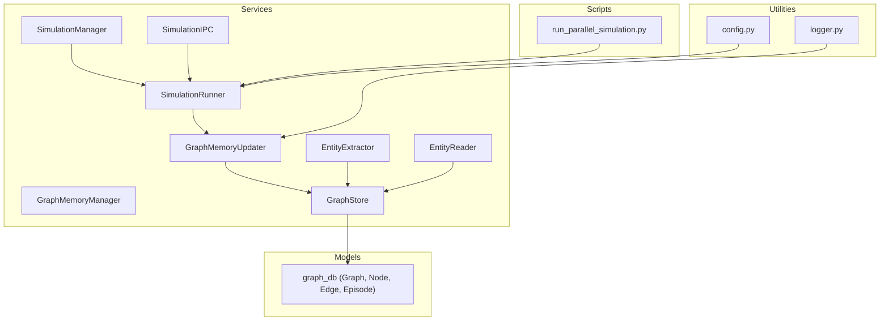
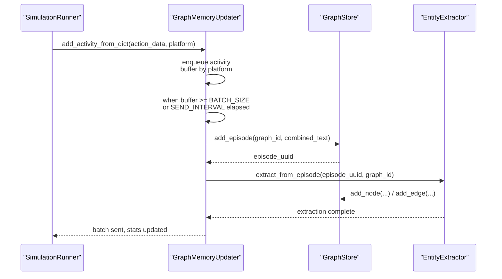
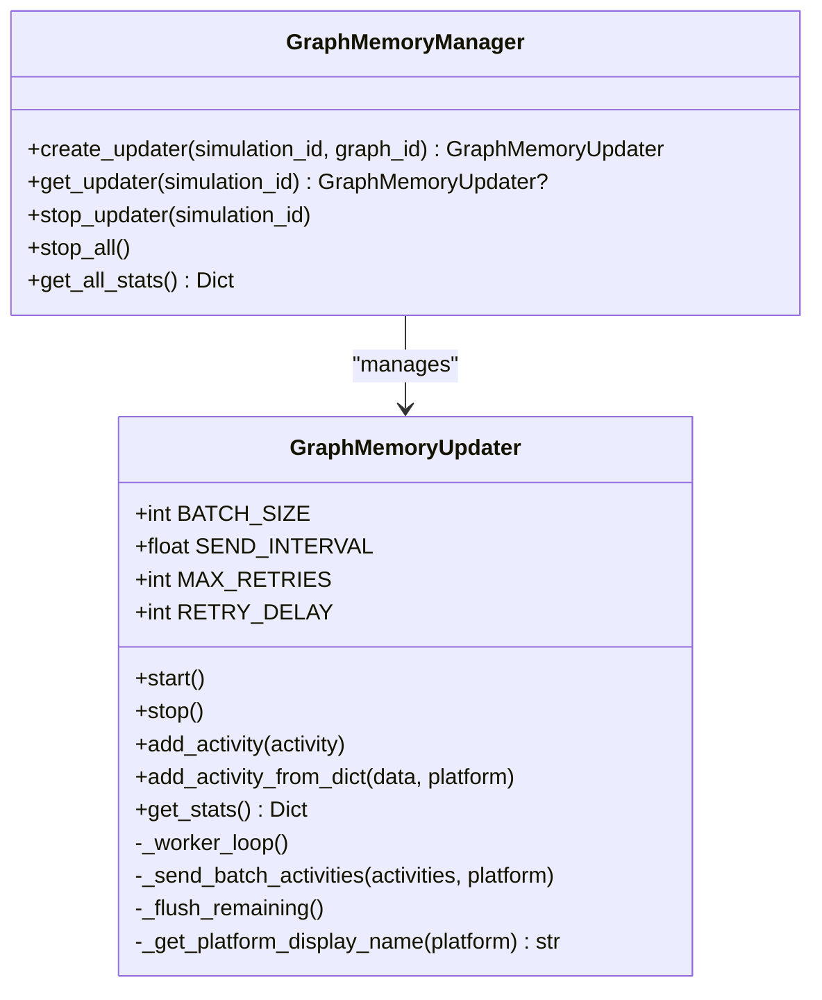
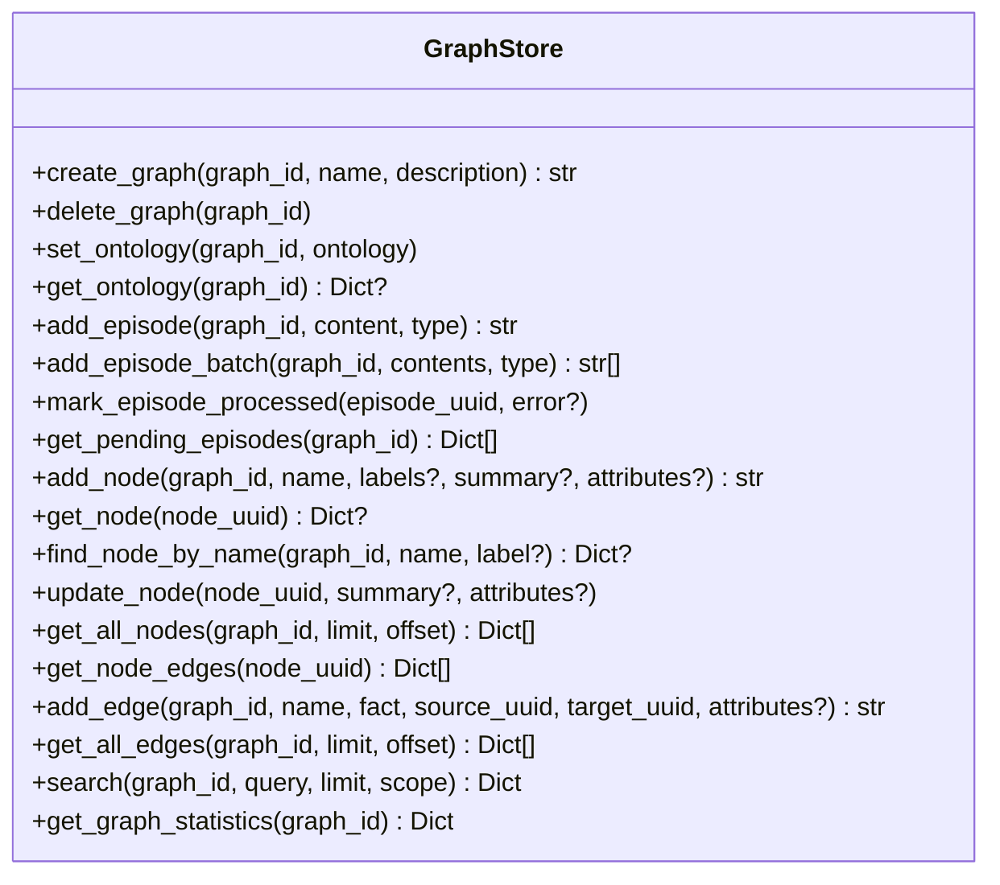
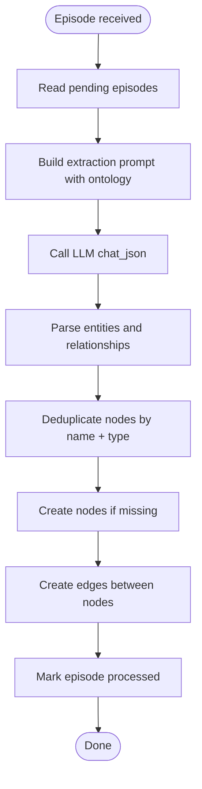
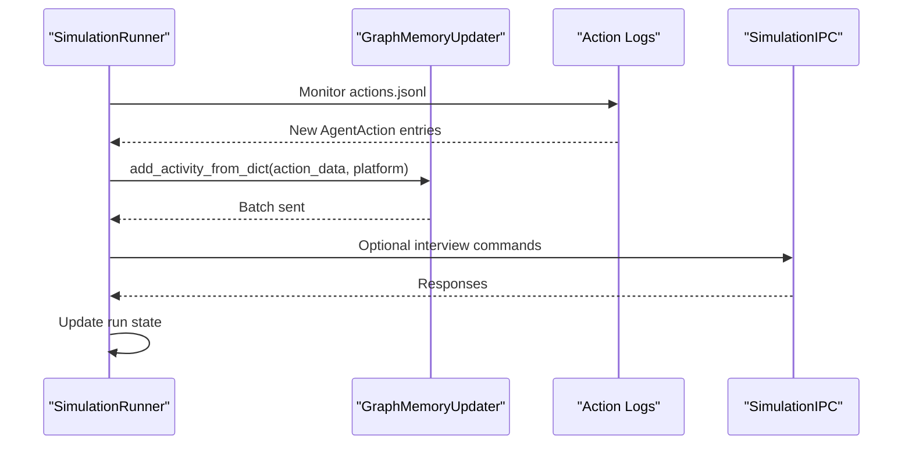
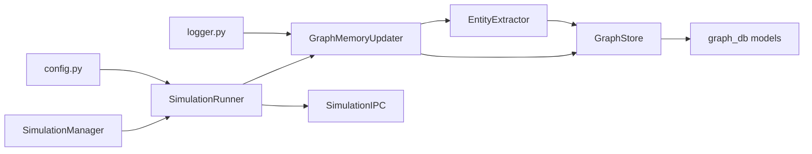

# Graph Memory Management

<cite>
**Referenced Files in This Document**
- [graph_memory_updater.py](file://backend/app/services/graph_memory_updater.py)
- [graph_store.py](file://backend/app/services/graph_store.py)
- [entity_extractor.py](file://backend/app/services/entity_extractor.py)
- [entity_reader.py](file://backend/app/services/entity_reader.py)
- [simulation_runner.py](file://backend/app/services/simulation_runner.py)
- [simulation_manager.py](file://backend/app/services/simulation_manager.py)
- [simulation_ipc.py](file://backend/app/services/simulation_ipc.py)
- [graph_db.py](file://backend/app/models/graph_db.py)
- [config.py](file://backend/app/config.py)
- [logger.py](file://backend/app/utils/logger.py)
- [run_parallel_simulation.py](file://backend/scripts/run_parallel_simulation.py)
</cite>

## Table of Contents
1. [Introduction](#introduction)
2. [Project Structure](#project-structure)
3. [Core Components](#core-components)
4. [Architecture Overview](#architecture-overview)
5. [Detailed Component Analysis](#detailed-component-analysis)
6. [Dependency Analysis](#dependency-analysis)
7. [Performance Considerations](#performance-considerations)
8. [Troubleshooting Guide](#troubleshooting-guide)
9. [Conclusion](#conclusion)
10. [Appendices](#appendices)

## Introduction
This document describes the Graph Memory Updater service that maintains agent memories and context within the knowledge graph during social simulation runs. It explains how the service monitors agent activities, converts them into natural language episodes, batches updates, and extracts entities and relationships for graph enrichment. It covers batching strategies, concurrency, retries, and integration with the simulation runner and graph store. It also documents configuration options, performance characteristics, and operational guidance for large-scale memory operations.

## Project Structure
The Graph Memory Management system spans several modules:
- Services: GraphMemoryUpdater, GraphMemoryManager, GraphStore, EntityExtractor, EntityReader, SimulationRunner, SimulationManager, SimulationIPC
- Models: SQLAlchemy graph database models (Graph, Node, Edge, Episode)
- Utilities: Logging and configuration
- Scripts: OASIS simulation runners that emit action logs consumed by the updater

**Diagram sources**
- [graph_memory_updater.py:178-424](file://backend/app/services/graph_memory_updater.py#L178-L424)
- [graph_store.py:21-375](file://backend/app/services/graph_store.py#L21-L375)
- [entity_extractor.py:16-291](file://backend/app/services/entity_extractor.py#L16-L291)
- [entity_reader.py:69-345](file://backend/app/services/entity_reader.py#L69-L345)
- [simulation_runner.py:195-800](file://backend/app/services/simulation_runner.py#L195-L800)
- [simulation_manager.py:114-529](file://backend/app/services/simulation_manager.py#L114-L529)
- [simulation_ipc.py:95-395](file://backend/app/services/simulation_ipc.py#L95-L395)
- [graph_db.py:24-151](file://backend/app/models/graph_db.py#L24-L151)
- [config.py:20-76](file://backend/app/config.py#L20-L76)
- [logger.py:30-127](file://backend/app/utils/logger.py#L30-L127)
- [run_parallel_simulation.py:1-800](file://backend/scripts/run_parallel_simulation.py#L1-L800)

**Section sources**
- [graph_memory_updater.py:1-425](file://backend/app/services/graph_memory_updater.py#L1-L425)
- [graph_store.py:1-375](file://backend/app/services/graph_store.py#L1-L375)
- [entity_extractor.py:1-291](file://backend/app/services/entity_extractor.py#L1-L291)
- [entity_reader.py:1-345](file://backend/app/services/entity_reader.py#L1-L345)
- [simulation_runner.py:1-800](file://backend/app/services/simulation_runner.py#L1-L800)
- [simulation_manager.py:1-529](file://backend/app/services/simulation_manager.py#L1-L529)
- [simulation_ipc.py:1-395](file://backend/app/services/simulation_ipc.py#L1-L395)
- [graph_db.py:1-151](file://backend/app/models/graph_db.py#L1-L151)
- [config.py:1-76](file://backend/app/config.py#L1-L76)
- [logger.py:1-127](file://backend/app/utils/logger.py#L1-L127)
- [run_parallel_simulation.py:1-800](file://backend/scripts/run_parallel_simulation.py#L1-L800)

## Core Components
- GraphMemoryUpdater: Real-time updater that consumes agent activities, buffers by platform, batches, and persists episodes for entity extraction.
- GraphMemoryManager: Singleton-like manager that creates, retrieves, and stops updaters per simulation.
- GraphStore: Unified access layer to PostgreSQL for graph lifecycle, episodes, nodes, edges, and statistics.
- EntityExtractor: LLM-driven extractor that transforms episodes into nodes and edges, deduplicating entities and merging summaries.
- EntityReader: Utility to read and filter entities from the graph for downstream use.
- SimulationRunner: Orchestrates simulation processes, parses action logs, and forwards activities to the updater.
- SimulationManager: Prepares simulations, generates profiles and configs, and coordinates run states.
- SimulationIPC: Inter-process communication bridge between backend and simulation scripts.
- Models: SQLAlchemy ORM for Graph, Node, Edge, Episode with indexes and vector support.
- Configuration and Logging: Centralized configuration and logging utilities.

**Section sources**
- [graph_memory_updater.py:178-424](file://backend/app/services/graph_memory_updater.py#L178-L424)
- [graph_store.py:21-375](file://backend/app/services/graph_store.py#L21-L375)
- [entity_extractor.py:16-291](file://backend/app/services/entity_extractor.py#L16-L291)
- [entity_reader.py:69-345](file://backend/app/services/entity_reader.py#L69-L345)
- [simulation_runner.py:195-800](file://backend/app/services/simulation_runner.py#L195-L800)
- [simulation_manager.py:114-529](file://backend/app/services/simulation_manager.py#L114-L529)
- [simulation_ipc.py:95-395](file://backend/app/services/simulation_ipc.py#L95-L395)
- [graph_db.py:24-151](file://backend/app/models/graph_db.py#L24-L151)
- [config.py:20-76](file://backend/app/config.py#L20-L76)
- [logger.py:30-127](file://backend/app/utils/logger.py#L30-L127)

## Architecture Overview
The updater operates as a background worker that:
- Receives AgentAction items from the SimulationRunner via add_activity_from_dict.
- Buffers activities by platform (Twitter/Reddit) using an internal lock-protected dictionary.
- Batches when buffer reaches BATCH_SIZE or after SEND_INTERVAL delay.
- Converts each batch into a natural language episode text and stores it as an Episode.
- Invokes EntityExtractor to parse the Episode and persist Nodes and Edges.
- Tracks statistics and retries with exponential backoff.

**Diagram sources**
- [simulation_runner.py:677-680](file://backend/app/services/simulation_runner.py#L677-L680)
- [graph_memory_updater.py:277-328](file://backend/app/services/graph_memory_updater.py#L277-L328)
- [graph_store.py:75-104](file://backend/app/services/graph_store.py#L75-L104)
- [entity_extractor.py:26-167](file://backend/app/services/entity_extractor.py#L26-L167)

**Section sources**
- [simulation_runner.py:578-687](file://backend/app/services/simulation_runner.py#L578-L687)
- [graph_memory_updater.py:178-366](file://backend/app/services/graph_memory_updater.py#L178-L366)
- [graph_store.py:75-167](file://backend/app/services/graph_store.py#L75-L167)
- [entity_extractor.py:26-167](file://backend/app/services/entity_extractor.py#L26-L167)

## Detailed Component Analysis

### GraphMemoryUpdater
Responsibilities:
- Consume AgentAction items from SimulationRunner.
- Buffer by platform with thread-safe locks.
- Batch activities and convert to natural language episode texts.
- Persist episodes and trigger entity extraction.
- Track metrics and manage lifecycle (start/stop).

Key behaviors:
- Batching: BATCH_SIZE controls batch size; SEND_INTERVAL introduces throttling between batches.
- Retries: MAX_RETRIES attempts with RETRY_DELAY backoff on failures.
- DO_NOTHING actions are skipped.
- Stats exposed via get_stats() including queue size and buffer sizes.

**Diagram sources**
- [graph_memory_updater.py:178-424](file://backend/app/services/graph_memory_updater.py#L178-L424)

**Section sources**
- [graph_memory_updater.py:178-366](file://backend/app/services/graph_memory_updater.py#L178-L366)

### GraphStore
Responsibilities:
- Graph lifecycle: create/delete graphs and set/get ontologies.
- Episodes: add single/batch episodes, mark processed, list pending.
- Nodes: add/find/update nodes, list with pagination, get edges.
- Edges: add edges.
- Search: full-text search across nodes and edges.
- Statistics: graph statistics including counts and entity type distribution.

**Diagram sources**
- [graph_store.py:21-375](file://backend/app/services/graph_store.py#L21-L375)

**Section sources**
- [graph_store.py:21-375](file://backend/app/services/graph_store.py#L21-L375)

### EntityExtractor
Responsibilities:
- Extract entities and relationships from Episode content using LLM.
- Deduplicate nodes by name and type; merge summaries when appropriate.
- Create nodes and edges, respecting labels and attributes.
- Mark episodes processed upon completion.

**Diagram sources**
- [entity_extractor.py:26-167](file://backend/app/services/entity_extractor.py#L26-L167)

**Section sources**
- [entity_extractor.py:16-291](file://backend/app/services/entity_extractor.py#L16-L291)

### SimulationRunner Integration
Responsibilities:
- Start/stop simulations and monitor action logs.
- Parse per-platform action logs (twitter/reddit) and forward activities to GraphMemoryUpdater.
- Track run state, recent actions, and platform completion.
- Stop GraphMemoryUpdater on simulation completion.

**Diagram sources**
- [simulation_runner.py:477-577](file://backend/app/services/simulation_runner.py#L477-L577)
- [simulation_runner.py:578-687](file://backend/app/services/simulation_runner.py#L578-L687)
- [simulation_ipc.py:95-395](file://backend/app/services/simulation_ipc.py#L95-L395)

**Section sources**
- [simulation_runner.py:195-800](file://backend/app/services/simulation_runner.py#L195-L800)
- [simulation_ipc.py:95-395](file://backend/app/services/simulation_ipc.py#L95-L395)

### SimulationManager and SimulationIPC
- SimulationManager orchestrates preparation and state management for simulations.
- SimulationIPC enables backend-to-script communication for interviews and environment control.

**Section sources**
- [simulation_manager.py:114-529](file://backend/app/services/simulation_manager.py#L114-L529)
- [simulation_ipc.py:95-395](file://backend/app/services/simulation_ipc.py#L95-L395)

## Dependency Analysis
- GraphMemoryUpdater depends on GraphStore and EntityExtractor.
- SimulationRunner depends on GraphMemoryManager and SimulationIPC.
- GraphStore depends on SQLAlchemy models and database configuration.
- EntityExtractor depends on LLMClient and GraphStore.
- SimulationRunner depends on configuration and logging utilities.

**Diagram sources**
- [graph_memory_updater.py:178-424](file://backend/app/services/graph_memory_updater.py#L178-L424)
- [graph_store.py:21-375](file://backend/app/services/graph_store.py#L21-L375)
- [entity_extractor.py:16-291](file://backend/app/services/entity_extractor.py#L16-L291)
- [simulation_runner.py:195-800](file://backend/app/services/simulation_runner.py#L195-L800)
- [simulation_manager.py:114-529](file://backend/app/services/simulation_manager.py#L114-L529)
- [simulation_ipc.py:95-395](file://backend/app/services/simulation_ipc.py#L95-L395)
- [graph_db.py:24-151](file://backend/app/models/graph_db.py#L24-L151)
- [config.py:20-76](file://backend/app/config.py#L20-L76)
- [logger.py:30-127](file://backend/app/utils/logger.py#L30-L127)

**Section sources**
- [graph_memory_updater.py:178-424](file://backend/app/services/graph_memory_updater.py#L178-L424)
- [graph_store.py:21-375](file://backend/app/services/graph_store.py#L21-L375)
- [entity_extractor.py:16-291](file://backend/app/services/entity_extractor.py#L16-L291)
- [simulation_runner.py:195-800](file://backend/app/services/simulation_runner.py#L195-L800)
- [simulation_manager.py:114-529](file://backend/app/services/simulation_manager.py#L114-L529)
- [simulation_ipc.py:95-395](file://backend/app/services/simulation_ipc.py#L95-L395)
- [graph_db.py:24-151](file://backend/app/models/graph_db.py#L24-L151)
- [config.py:20-76](file://backend/app/config.py#L20-L76)
- [logger.py:30-127](file://backend/app/utils/logger.py#L30-L127)

## Performance Considerations
- Batching and throttling: BATCH_SIZE and SEND_INTERVAL balance throughput and latency. Larger batches reduce overhead but increase memory and latency; smaller batches improve responsiveness.
- Concurrency: Thread-safe buffering with locks prevents race conditions; daemon threads ensure graceful shutdown.
- Retries: MAX_RETRIES with RETRY_DELAY backoff reduces transient failure impact; consider tuning for network/database stability.
- Database pooling: GraphStore uses scoped sessions with connection pooling; ensure DATABASE_URL and pool settings align with workload.
- Indexing: Nodes and edges have indexes on graph_id and name; consider adding indexes for frequently queried attributes.
- LLM calls: Entity extraction is rate-limited by batch cadence; consider rate limits and cost controls.
- Logging: Rotating file handlers prevent disk growth; adjust log levels for production.

[No sources needed since this section provides general guidance]

## Troubleshooting Guide
Common issues and resolutions:
- Updater not receiving activities:
  - Verify SimulationRunner is forwarding actions via add_activity_from_dict and GraphMemoryManager is created with enable_graph_memory_update.
  - Check platform filters and event_type filtering in SimulationRunner’s log parsing.
- Extraction failures:
  - Review EntityExtractor error handling and episode marking; check LLM availability and prompts.
- Database connectivity:
  - Confirm DATABASE_URL and credentials; verify migrations and indexes.
- Stuck or slow batches:
  - Inspect queue size and buffer sizes via get_stats(); adjust BATCH_SIZE and SEND_INTERVAL.
- Simulation shutdown:
  - Ensure SimulationRunner stops GraphMemoryUpdater on completion and process termination.

**Section sources**
- [simulation_runner.py:550-577](file://backend/app/services/simulation_runner.py#L550-L577)
- [entity_extractor.py:164-167](file://backend/app/services/entity_extractor.py#L164-L167)
- [graph_store.py:132-151](file://backend/app/services/graph_store.py#L132-L151)
- [graph_memory_updater.py:350-366](file://backend/app/services/graph_memory_updater.py#L350-L366)

## Conclusion
The Graph Memory Updater provides a robust, real-time mechanism to transform agent activities into enriched knowledge graph entities and relationships. Its batching, concurrency, and retry strategies ensure reliable updates during dynamic simulations. Integration with SimulationRunner and GraphStore enables scalable memory management, while EntityExtractor ensures high-quality entity and relationship extraction. Proper configuration and monitoring are essential for large-scale deployments.

[No sources needed since this section summarizes without analyzing specific files]

## Appendices

### Memory Update Algorithms
- Activity ingestion: Buffered by platform with thread-safe locks.
- Batching: Triggered by batch size or send interval.
- Episode creation: Natural language episode text composed from activities.
- Entity extraction: LLM-driven parsing with deduplication and edge creation.
- Persistence: Episodes marked processed; nodes and edges persisted.

**Section sources**
- [graph_memory_updater.py:277-328](file://backend/app/services/graph_memory_updater.py#L277-L328)
- [entity_extractor.py:26-167](file://backend/app/services/entity_extractor.py#L26-L167)

### Context Preservation Strategies
- Episode composition preserves action context (e.g., post content, author names).
- EntityExtractor merges summaries when nodes already exist.
- Ontology-aware extraction improves entity and relationship typing.

**Section sources**
- [entity_extractor.py:42-46](file://backend/app/services/entity_extractor.py#L42-L46)
- [entity_extractor.py:63-78](file://backend/app/services/entity_extractor.py#L63-L78)

### Memory Consolidation Processes
- Pending episodes are processed in order; GraphStore.get_pending_episodes returns unprocessed items.
- Deduplication prevents redundant nodes; edges are created with attributes and facts.

**Section sources**
- [graph_store.py:115-124](file://backend/app/services/graph_store.py#L115-L124)
- [entity_extractor.py:63-92](file://backend/app/services/entity_extractor.py#L63-L92)

### Integration with Simulation Agents
- SimulationRunner parses action logs and forwards activities to GraphMemoryUpdater.
- SimulationIPC supports interactive interviews and environment control.

**Section sources**
- [simulation_runner.py:578-687](file://backend/app/services/simulation_runner.py#L578-L687)
- [simulation_ipc.py:95-395](file://backend/app/services/simulation_ipc.py#L95-L395)

### Memory Indexing, Retrieval Optimization, and Cache Management
- Indexes: Nodes indexed by graph_id and name; edges indexed by graph_id and node UUIDs.
- Search: Full-text search across node names/summaries and edge facts.
- Caching: No explicit caching layer; rely on database indexes and connection pooling.

**Section sources**
- [graph_db.py:55-105](file://backend/app/models/graph_db.py#L55-L105)
- [graph_store.py:259-316](file://backend/app/services/graph_store.py#L259-L316)

### Examples of Memory Update Triggers
- Agent actions emitted by OASIS scripts (e.g., CREATE_POST, LIKE_POST, FOLLOW).
- Event types: simulation_start, round_end, simulation_end are handled for run state.

**Section sources**
- [run_parallel_simulation.py:604-631](file://backend/scripts/run_parallel_simulation.py#L604-L631)
- [simulation_runner.py:613-658](file://backend/app/services/simulation_runner.py#L613-L658)

### Conflict Resolution and Consistency Maintenance
- Deduplication by name and type prevents duplicate nodes.
- Merging summaries when existing nodes lack summaries.
- Atomic operations via GraphStore session context managers.
- Episode processing flag ensures idempotent extraction.

**Section sources**
- [entity_extractor.py:63-78](file://backend/app/services/entity_extractor.py#L63-L78)
- [entity_extractor.py:156-162](file://backend/app/services/entity_extractor.py#L156-L162)
- [graph_store.py:370-375](file://backend/app/services/graph_store.py#L370-L375)

### Performance Considerations for Large-Scale Operations
- Adjust BATCH_SIZE and SEND_INTERVAL based on throughput and latency targets.
- Monitor queue size and buffer sizes via get_stats().
- Tune database pool settings and indexes for high-volume writes.
- Control LLM rate limits and consider asynchronous extraction.

**Section sources**
- [graph_memory_updater.py:186-197](file://backend/app/services/graph_memory_updater.py#L186-L197)
- [graph_memory_updater.py:350-366](file://backend/app/services/graph_memory_updater.py#L350-L366)
- [graph_store.py:117-124](file://backend/app/services/graph_store.py#L117-L124)

### Concurrent Access Patterns
- Thread-safe buffering with locks; daemon worker thread for non-blocking operation.
- Scoped sessions for thread-local database sessions.
- Atomic episode processing and node/edge creation.

**Section sources**
- [graph_memory_updater.py:209-210](file://backend/app/services/graph_memory_updater.py#L209-L210)
- [graph_store.py:370-375](file://backend/app/services/graph_store.py#L370-L375)

### Configuration Options
- LLM configuration: LLM_API_KEY, LLM_BASE_URL, LLM_MODEL_NAME.
- Database configuration: DATABASE_URL.
- OASIS platform actions: OASIS_TWITTER_ACTIONS, OASIS_REDDIT_ACTIONS.
- Report agent configuration: REPORT_AGENT_MAX_TOOL_CALLS, REPORT_AGENT_MAX_REFLECTION_ROUNDS, REPORT_AGENT_TEMPERATURE.
- Simulation defaults: OASIS_DEFAULT_MAX_ROUNDS, OASIS_SIMULATION_DATA_DIR.

**Section sources**
- [config.py:20-76](file://backend/app/config.py#L20-L76)