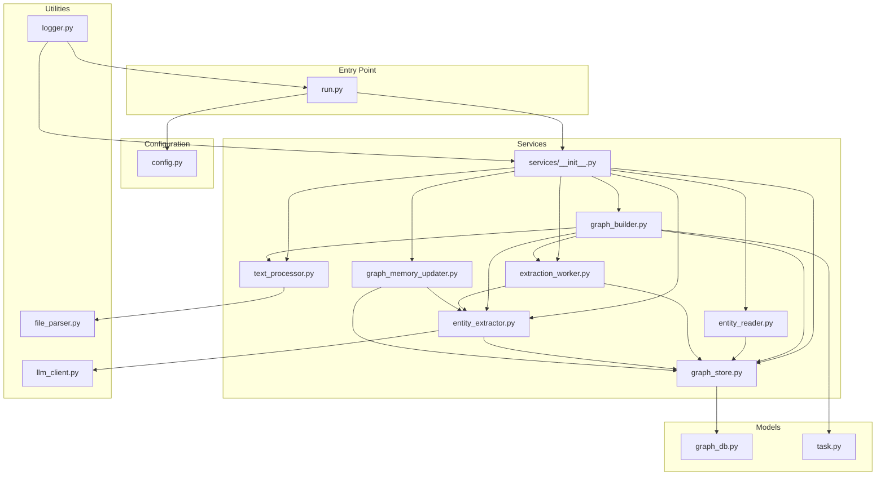
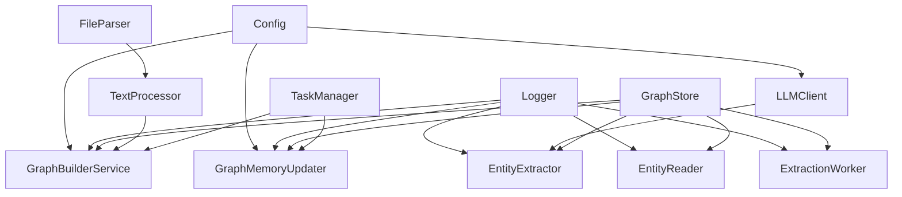
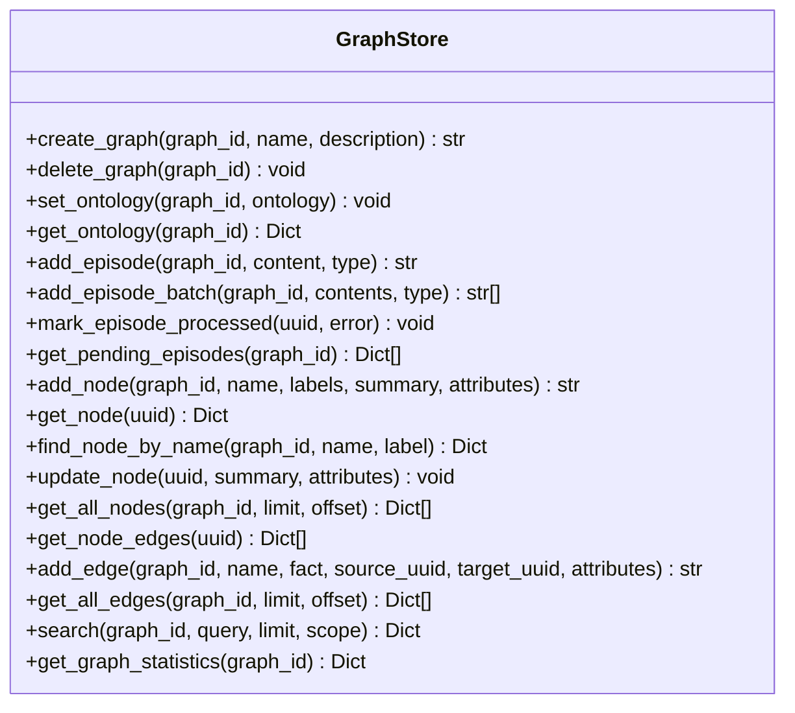
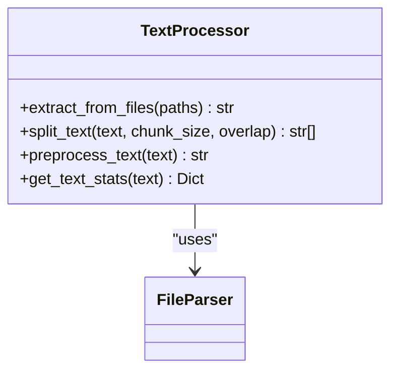
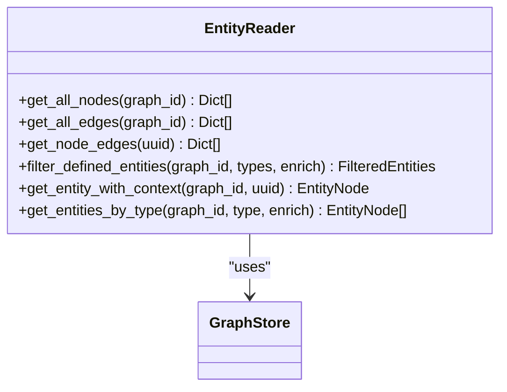
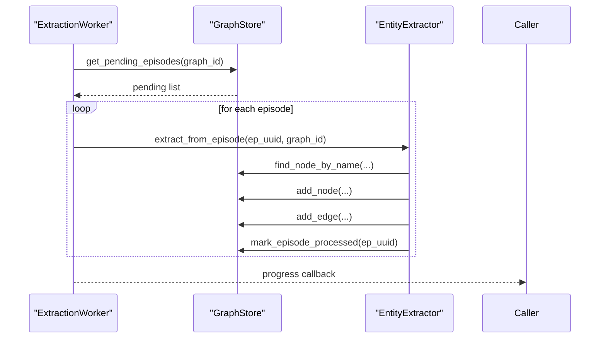
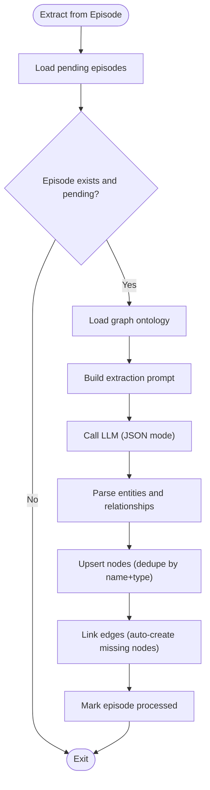
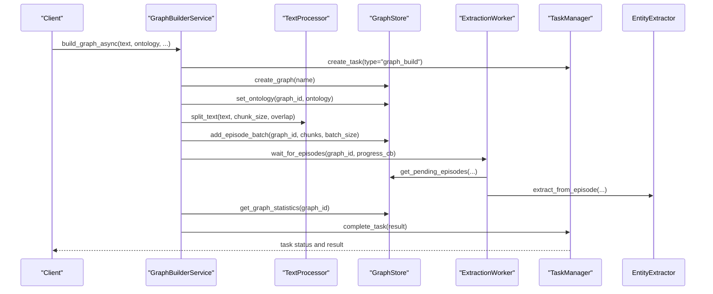
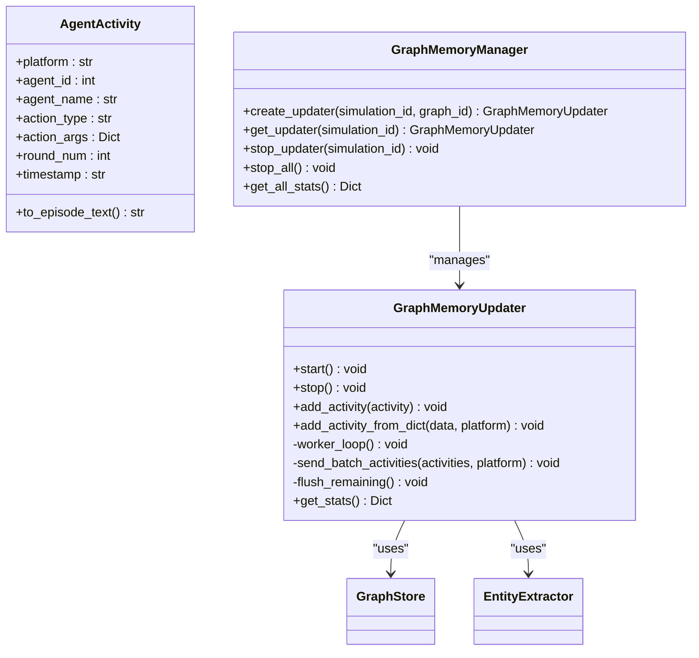
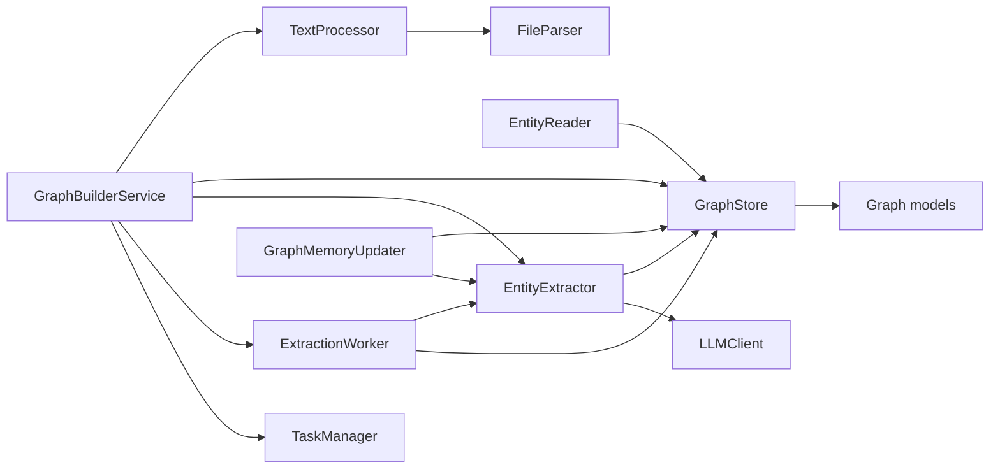

# Service Layer Architecture

<cite>
**Referenced Files in This Document**
- [run.py](file://backend/run.py)
- [config.py](file://backend/app/config.py)
- [logger.py](file://backend/app/utils/logger.py)
- [llm_client.py](file://backend/app/utils/llm_client.py)
- [file_parser.py](file://backend/app/utils/file_parser.py)
- [graph_db.py](file://backend/app/models/graph_db.py)
- [__init__.py](file://backend/app/services/__init__.py)
- [graph_store.py](file://backend/app/services/graph_store.py)
- [text_processor.py](file://backend/app/services/text_processor.py)
- [entity_reader.py](file://backend/app/services/entity_reader.py)
- [extraction_worker.py](file://backend/app/services/extraction_worker.py)
- [entity_extractor.py](file://backend/app/services/entity_extractor.py)
- [graph_builder.py](file://backend/app/services/graph_builder.py)
- [graph_memory_updater.py](file://backend/app/services/graph_memory_updater.py)
- [task.py](file://backend/app/models/task.py)
</cite>

## Table of Contents
1. [Introduction](#introduction)
2. [Project Structure](#project-structure)
3. [Core Components](#core-components)
4. [Architecture Overview](#architecture-overview)
5. [Detailed Component Analysis](#detailed-component-analysis)
6. [Dependency Analysis](#dependency-analysis)
7. [Performance Considerations](#performance-considerations)
8. [Troubleshooting Guide](#troubleshooting-guide)
9. [Conclusion](#conclusion)
10. [Appendices](#appendices)

## Introduction
This document describes the service layer architecture that implements business logic and application services for knowledge graph construction, persistence, retrieval, and maintenance. It explains design patterns such as dependency injection, service composition, and business rule enforcement. It documents the graph store service for persistence and retrieval, the text processor service for document analysis and content preparation, the entity reader service for structured data extraction and validation, the extraction worker service for background processing and task management, and the graph memory updater service for maintaining agent memories and context. It also covers service interaction patterns, error handling strategies, testing approaches, performance considerations, scalability patterns, and monitoring.

## Project Structure
The backend is organized around a layered architecture:
- Entry point initializes configuration and starts the application.
- Services encapsulate business logic and orchestrate domain operations.
- Models define the persistent graph schema and database session lifecycle.
- Utilities provide cross-cutting concerns like logging, LLM client, and file parsing.
- Tasks manage long-running operations and progress reporting.

**Diagram sources**
- [run.py:1-51](file://backend/run.py#L1-L51)
- [config.py:1-76](file://backend/app/config.py#L1-L76)
- [graph_store.py:1-375](file://backend/app/services/graph_store.py#L1-L375)
- [text_processor.py:1-72](file://backend/app/services/text_processor.py#L1-L72)
- [entity_reader.py:1-345](file://backend/app/services/entity_reader.py#L1-L345)
- [extraction_worker.py:1-109](file://backend/app/services/extraction_worker.py#L1-L109)
- [entity_extractor.py:1-291](file://backend/app/services/entity_extractor.py#L1-L291)
- [graph_builder.py:1-307](file://backend/app/services/graph_builder.py#L1-L307)
- [graph_memory_updater.py:1-425](file://backend/app/services/graph_memory_updater.py#L1-L425)
- [graph_db.py:1-151](file://backend/app/models/graph_db.py#L1-L151)
- [task.py:1-185](file://backend/app/models/task.py#L1-L185)
- [logger.py:1-127](file://backend/app/utils/logger.py#L1-L127)
- [llm_client.py:1-104](file://backend/app/utils/llm_client.py#L1-L104)
- [file_parser.py:1-190](file://backend/app/utils/file_parser.py#L1-L190)
- [__init__.py:1-73](file://backend/app/services/__init__.py#L1-L73)

**Section sources**
- [run.py:1-51](file://backend/run.py#L1-L51)
- [config.py:1-76](file://backend/app/config.py#L1-L76)

## Core Components
- GraphStore: Unified persistence layer for graphs, nodes, edges, episodes, and statistics. Provides CRUD, search, and batch operations backed by PostgreSQL.
- TextProcessor: Prepares raw text for ingestion by extracting from files and splitting into chunks.
- EntityReader: Reads graph nodes and filters them into structured entities, optionally enriching with related edges and nodes.
- ExtractionWorker: Background processor that continuously drains pending episodes and triggers LLM-based extraction.
- EntityExtractor: Orchestrates LLM prompts, parses JSON responses, and persists deduplicated entities and relationships.
- GraphBuilderService: Orchestration service for asynchronous graph construction, coordinating text preprocessing, episode batching, and extraction.
- GraphMemoryUpdater: Real-time updater that converts agent activities into natural language episodes and persists them to the graph.
- TaskManager: Thread-safe task lifecycle management for long-running operations with progress and status reporting.
- Logging and LLM utilities: Centralized logging and a unified LLM client wrapper.

**Section sources**
- [graph_store.py:21-375](file://backend/app/services/graph_store.py#L21-L375)
- [text_processor.py:9-72](file://backend/app/services/text_processor.py#L9-L72)
- [entity_reader.py:69-345](file://backend/app/services/entity_reader.py#L69-L345)
- [extraction_worker.py:16-109](file://backend/app/services/extraction_worker.py#L16-L109)
- [entity_extractor.py:16-291](file://backend/app/services/entity_extractor.py#L16-L291)
- [graph_builder.py:39-307](file://backend/app/services/graph_builder.py#L39-L307)
- [graph_memory_updater.py:178-425](file://backend/app/services/graph_memory_updater.py#L178-L425)
- [task.py:54-185](file://backend/app/models/task.py#L54-L185)
- [logger.py:91-127](file://backend/app/utils/logger.py#L91-L127)
- [llm_client.py:14-104](file://backend/app/utils/llm_client.py#L14-L104)

## Architecture Overview
The service layer follows a composition pattern:
- Services depend on shared utilities (logging, LLM client, file parser).
- Domain services depend on the GraphStore for persistence and on each other for orchestration.
- Long-running operations are coordinated via TaskManager.
- The entry point validates configuration and starts the application.

**Diagram sources**
- [config.py:20-76](file://backend/app/config.py#L20-L76)
- [logger.py:91-127](file://backend/app/utils/logger.py#L91-L127)
- [llm_client.py:14-104](file://backend/app/utils/llm_client.py#L14-L104)
- [file_parser.py:61-190](file://backend/app/utils/file_parser.py#L61-L190)
- [graph_store.py:21-375](file://backend/app/services/graph_store.py#L21-L375)
- [text_processor.py:9-72](file://backend/app/services/text_processor.py#L9-L72)
- [entity_reader.py:69-345](file://backend/app/services/entity_reader.py#L69-L345)
- [extraction_worker.py:16-109](file://backend/app/services/extraction_worker.py#L16-L109)
- [entity_extractor.py:16-291](file://backend/app/services/entity_extractor.py#L16-L291)
- [graph_builder.py:39-307](file://backend/app/services/graph_builder.py#L39-L307)
- [graph_memory_updater.py:178-425](file://backend/app/services/graph_memory_updater.py#L178-L425)
- [task.py:54-185](file://backend/app/models/task.py#L54-L185)

## Detailed Component Analysis

### GraphStore Service
Responsibilities:
- Manage graph lifecycle (create/delete).
- Store and retrieve graph ontologies.
- Manage episodes (add, batch add, mark processed, list pending).
- CRUD for nodes and edges, including search and statistics.
- Provide helpers for edge conversion and session management.

Design patterns:
- Session management via context manager for transaction safety.
- Centralized logging for auditability.
- JSONB storage for flexible ontologies.

Key operations:
- Create graph, delete graph, set/get ontology.
- Add episodes (single/batch), mark processed, get pending.
- Node CRUD and enrichment queries.
- Edge CRUD and listing.
- Full-text search across edges and nodes.
- Statistics aggregation.

**Diagram sources**
- [graph_store.py:21-375](file://backend/app/services/graph_store.py#L21-L375)

**Section sources**
- [graph_store.py:21-375](file://backend/app/services/graph_store.py#L21-L375)
- [graph_db.py:24-151](file://backend/app/models/graph_db.py#L24-L151)

### TextProcessor Service
Responsibilities:
- Extract text from multiple files.
- Split text into overlapping chunks.
- Preprocess text (normalize whitespace and line breaks).
- Compute basic text statistics.

Integration:
- Uses FileParser for extraction and split_text_into_chunks for chunking.

**Diagram sources**
- [text_processor.py:9-72](file://backend/app/services/text_processor.py#L9-L72)
- [file_parser.py:61-190](file://backend/app/utils/file_parser.py#L61-L190)

**Section sources**
- [text_processor.py:9-72](file://backend/app/services/text_processor.py#L9-L72)
- [file_parser.py:61-190](file://backend/app/utils/file_parser.py#L61-L190)

### EntityReader Service
Responsibilities:
- Retrieve all nodes and edges for a graph.
- Filter nodes by predefined entity types (labels excluding default ones).
- Enrich entities with related edges and associated nodes.
- Provide contextual entity retrieval.

Business rule enforcement:
- Only keeps nodes with labels beyond default "Entity" and "Node".
- Supports optional type filtering.

**Diagram sources**
- [entity_reader.py:69-345](file://backend/app/services/entity_reader.py#L69-L345)
- [graph_store.py:21-375](file://backend/app/services/graph_store.py#L21-L375)

**Section sources**
- [entity_reader.py:69-345](file://backend/app/services/entity_reader.py#L69-L345)

### ExtractionWorker Service
Responsibilities:
- Continuously processes pending episodes for a graph.
- Invokes EntityExtractor per episode.
- Implements timeout and progress callbacks.
- Marks episodes as processed or failed.

**Diagram sources**
- [extraction_worker.py:16-109](file://backend/app/services/extraction_worker.py#L16-L109)
- [entity_extractor.py:16-291](file://backend/app/services/entity_extractor.py#L16-L291)
- [graph_store.py:21-375](file://backend/app/services/graph_store.py#L21-L375)

**Section sources**
- [extraction_worker.py:16-109](file://backend/app/services/extraction_worker.py#L16-L109)
- [entity_extractor.py:16-291](file://backend/app/services/entity_extractor.py#L16-L291)

### EntityExtractor Service
Responsibilities:
- Build extraction prompts using graph ontology.
- Call LLM to produce structured JSON (entities and relationships).
- Deduplicate and persist nodes and edges.
- Handle missing nodes by auto-creation when referenced.

**Diagram sources**
- [entity_extractor.py:16-291](file://backend/app/services/entity_extractor.py#L16-L291)
- [graph_store.py:21-375](file://backend/app/services/graph_store.py#L21-L375)
- [llm_client.py:14-104](file://backend/app/utils/llm_client.py#L14-L104)

**Section sources**
- [entity_extractor.py:16-291](file://backend/app/services/entity_extractor.py#L16-L291)
- [llm_client.py:14-104](file://backend/app/utils/llm_client.py#L14-L104)

### GraphBuilderService
Responsibilities:
- Asynchronously build a knowledge graph from text.
- Split text, batch episodes, and trigger LLM extraction.
- Track progress via TaskManager and return graph info.

**Diagram sources**
- [graph_builder.py:39-307](file://backend/app/services/graph_builder.py#L39-L307)
- [text_processor.py:9-72](file://backend/app/services/text_processor.py#L9-L72)
- [graph_store.py:21-375](file://backend/app/services/graph_store.py#L21-L375)
- [extraction_worker.py:16-109](file://backend/app/services/extraction_worker.py#L16-L109)
- [task.py:54-185](file://backend/app/models/task.py#L54-L185)

**Section sources**
- [graph_builder.py:39-307](file://backend/app/services/graph_builder.py#L39-L307)
- [task.py:54-185](file://backend/app/models/task.py#L54-L185)

### GraphMemoryUpdater Service
Responsibilities:
- Convert agent activities into natural language episode texts.
- Batch and send episodes to the graph, triggering LLM extraction.
- Maintain internal buffers per platform and enforce retry/backoff.
- Expose statistics and lifecycle controls.

**Diagram sources**
- [graph_memory_updater.py:178-425](file://backend/app/services/graph_memory_updater.py#L178-L425)
- [graph_store.py:21-375](file://backend/app/services/graph_store.py#L21-L375)
- [entity_extractor.py:16-291](file://backend/app/services/entity_extractor.py#L16-L291)

**Section sources**
- [graph_memory_updater.py:178-425](file://backend/app/services/graph_memory_updater.py#L178-L425)

### Service Composition and Integration
- Services are composed through constructor injection (dependencies passed to constructors).
- GraphBuilderService composes TextProcessor, GraphStore, EntityExtractor, ExtractionWorker, and TaskManager.
- EntityReader composes GraphStore.
- ExtractionWorker composes EntityExtractor and GraphStore.
- EntityExtractor composes GraphStore and LLMClient.
- GraphMemoryUpdater composes GraphStore and EntityExtractor and manages lifecycle via GraphMemoryManager.

**Section sources**
- [graph_builder.py:39-50](file://backend/app/services/graph_builder.py#L39-L50)
- [entity_reader.py:79-80](file://backend/app/services/entity_reader.py#L79-L80)
- [extraction_worker.py:22-24](file://backend/app/services/extraction_worker.py#L22-L24)
- [entity_extractor.py:22-24](file://backend/app/services/entity_extractor.py#L22-L24)
- [graph_memory_updater.py:198-201](file://backend/app/services/graph_memory_updater.py#L198-L201)

## Dependency Analysis
- External dependencies:
  - SQLAlchemy ORM for PostgreSQL persistence.
  - OpenAI-compatible LLM client for JSON-mode extraction.
  - PyMuPDF for PDF parsing.
  - Optional charset_normalizer and chardet for robust text decoding.
- Internal dependencies:
  - Services depend on GraphStore for persistence.
  - Services depend on utilities for logging and LLM interactions.
  - GraphBuilderService depends on TaskManager for progress tracking.
  - GraphMemoryUpdater depends on EntityExtractor and GraphStore.

**Diagram sources**
- [text_processor.py:5-6](file://backend/app/services/text_processor.py#L5-L6)
- [file_parser.py:61-190](file://backend/app/utils/file_parser.py#L61-L190)
- [entity_reader.py:10](file://backend/app/services/entity_reader.py#L10)
- [extraction_worker.py:9-11](file://backend/app/services/extraction_worker.py#L9-L11)
- [entity_extractor.py:10-11](file://backend/app/services/entity_extractor.py#L10-L11)
- [llm_client.py:9-11](file://backend/app/utils/llm_client.py#L9-L11)
- [graph_builder.py:13-19](file://backend/app/services/graph_builder.py#L13-L19)
- [graph_memory_updater.py:15-16](file://backend/app/services/graph_memory_updater.py#L15-L16)
- [graph_store.py:12-16](file://backend/app/services/graph_store.py#L12-L16)
- [graph_db.py:6-21](file://backend/app/models/graph_db.py#L6-L21)

**Section sources**
- [graph_db.py:6-21](file://backend/app/models/graph_db.py#L6-L21)
- [llm_client.py:9-11](file://backend/app/utils/llm_client.py#L9-L11)
- [file_parser.py:61-190](file://backend/app/utils/file_parser.py#L61-L190)

## Performance Considerations
- Database:
  - Use batched inserts for episodes and nodes/edges to reduce round-trips.
  - Leverage indexes on graph_id, node name, and episode processed flags.
  - Connection pooling and pre-ping to handle concurrent workloads.
- Text processing:
  - Tune chunk size and overlap to balance LLM context limits and recall.
  - Use sentence-aware chunking to minimize boundary-induced semantic loss.
- Extraction:
  - Deduplicate nodes by name and type to avoid redundant writes.
  - Retry failed episodes with exponential backoff.
- Memory updates:
  - Batch activities to reduce write frequency and leverage LLM throughput.
  - Monitor queue sizes and buffer flushes to prevent backlog accumulation.
- Observability:
  - Use structured logs with correlation IDs for tracing.
  - Track task progress and endpoint metrics for SLA visibility.

[No sources needed since this section provides general guidance]

## Troubleshooting Guide
Common issues and strategies:
- LLM JSON parsing failures:
  - Validate response format and strip markdown code blocks before parsing.
  - Lower temperature for deterministic JSON generation.
- Missing or misconfigured credentials:
  - Validate LLM API key and base URL; ensure environment variables are loaded.
- Database connectivity:
  - Confirm DATABASE_URL and connection pooling settings.
  - Use pre-ping and rollback semantics to recover from transient failures.
- Extraction worker timeouts:
  - Adjust timeout and progress callbacks; monitor episode processing lag.
- Entity deduplication mismatches:
  - Verify label filtering logic and node name/type combinations.

**Section sources**
- [llm_client.py:70-104](file://backend/app/utils/llm_client.py#L70-L104)
- [config.py:30-76](file://backend/app/config.py#L30-L76)
- [graph_store.py:370-375](file://backend/app/services/graph_store.py#L370-L375)
- [extraction_worker.py:30-109](file://backend/app/services/extraction_worker.py#L30-L109)
- [entity_reader.py:128-244](file://backend/app/services/entity_reader.py#L128-L244)

## Conclusion
The service layer cleanly separates persistence, text processing, extraction, and orchestration concerns. It enforces business rules through explicit filtering and deduplication, supports asynchronous workflows via background workers and task managers, and maintains observability through centralized logging. The architecture is modular, testable, and scalable, with clear extension points for additional platforms and extraction strategies.

[No sources needed since this section summarizes without analyzing specific files]

## Appendices

### Service Interaction Patterns
- Dependency Injection:
  - Services receive dependencies via constructor arguments, enabling easy mocking and testing.
- Service Composition:
  - Higher-level services (GraphBuilderService, GraphMemoryUpdater) compose lower-level services.
- Business Rule Enforcement:
  - EntityReader filters nodes by label semantics; EntityExtractor enforces deduplication and auto-creation.
- Error Handling:
  - Try/catch around critical operations; mark episodes as processed with error metadata; log warnings and errors.

**Section sources**
- [entity_reader.py:128-244](file://backend/app/services/entity_reader.py#L128-L244)
- [entity_extractor.py:164-167](file://backend/app/services/entity_extractor.py#L164-L167)
- [extraction_worker.py:82-88](file://backend/app/services/extraction_worker.py#L82-L88)

### Testing Approaches
- Unit tests:
  - Mock GraphStore and LLMClient to isolate service logic.
  - Test TextProcessor chunking and FileParser extraction with representative inputs.
- Integration tests:
  - Use an in-memory database or test container to exercise GraphStore operations.
  - Validate end-to-end graph building pipeline with synthetic text and small batches.
- Concurrency tests:
  - Validate ExtractionWorker and GraphMemoryUpdater under load with multiple threads and queues.

[No sources needed since this section provides general guidance]

### Monitoring and Metrics
- Logs:
  - Use structured logging with timestamps and correlation IDs for traceability.
- Metrics:
  - Track episode processing rates, extraction latency, and memory updater throughput.
- Health checks:
  - Expose readiness/liveness endpoints and database connectivity probes.

**Section sources**
- [logger.py:30-127](file://backend/app/utils/logger.py#L30-L127)
- [graph_memory_updater.py:350-366](file://backend/app/services/graph_memory_updater.py#L350-L366)