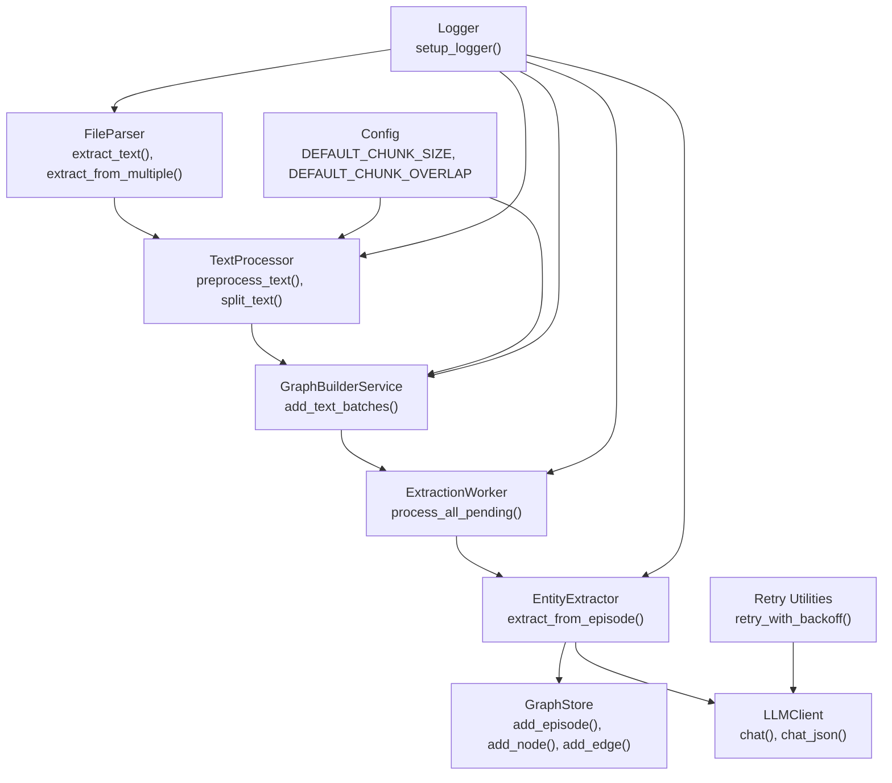
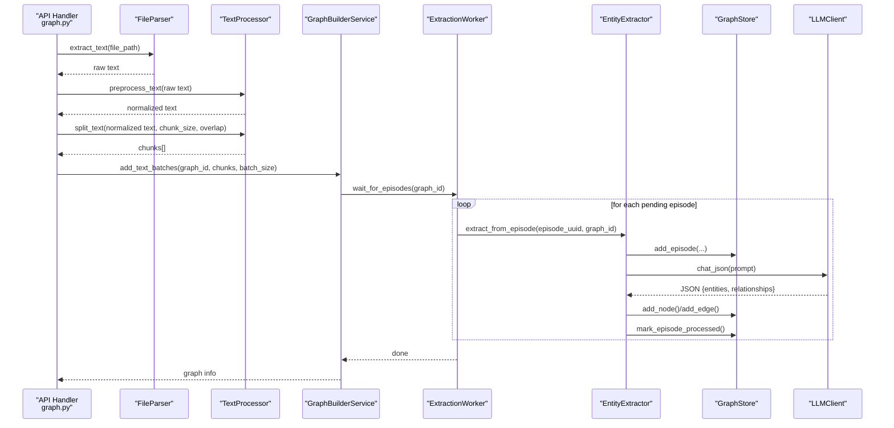
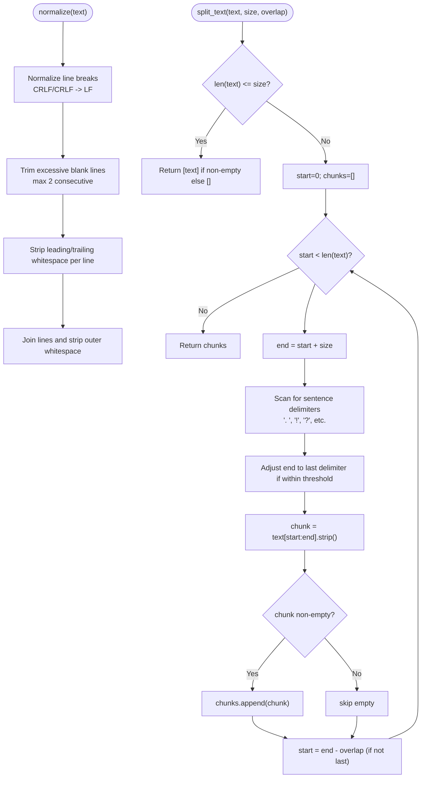
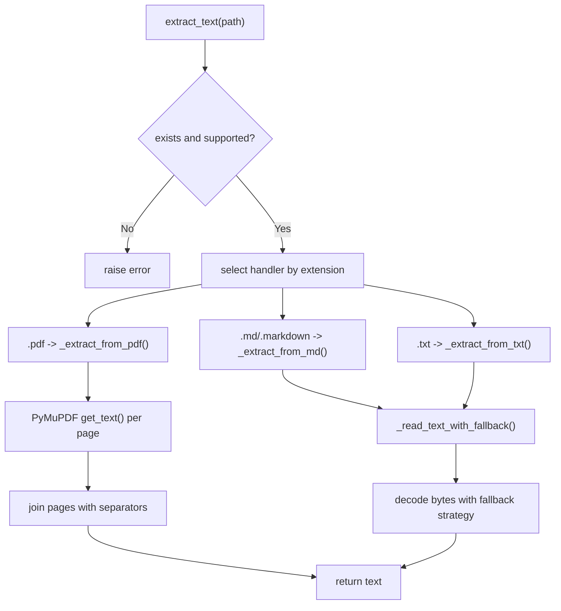
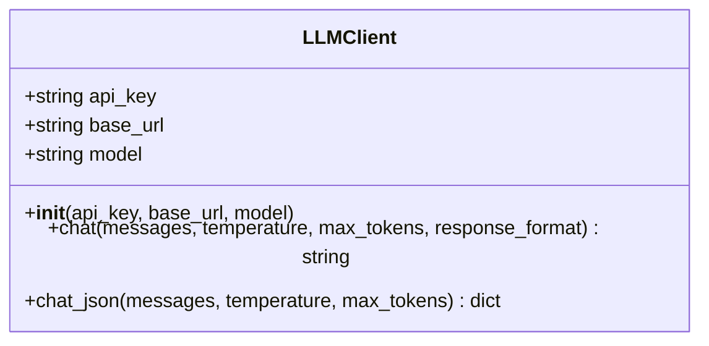
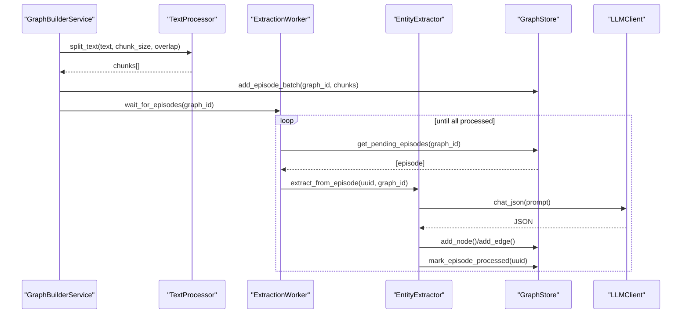
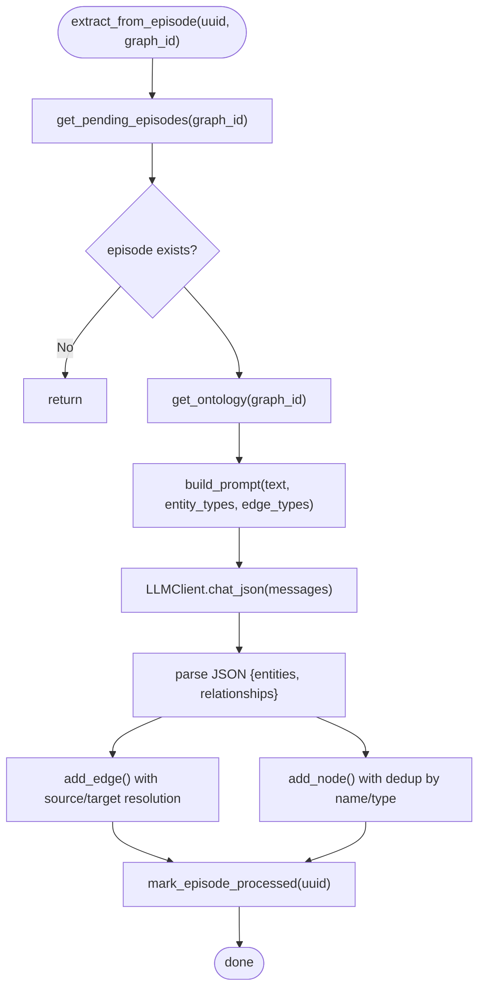
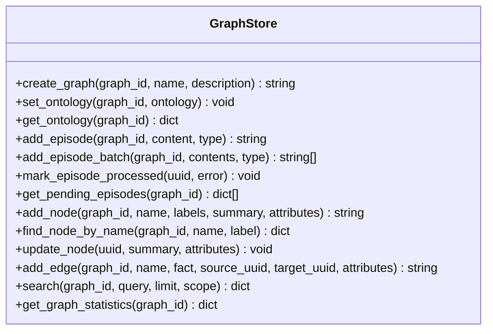
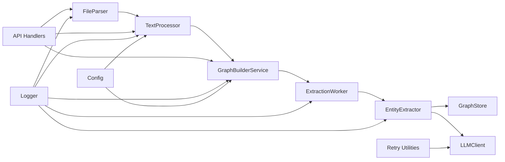

# Text Processing Service

<cite>
**Referenced Files in This Document**
- [text_processor.py](file://backend/app/services/text_processor.py)
- [file_parser.py](file://backend/app/utils/file_parser.py)
- [llm_client.py](file://backend/app/utils/llm_client.py)
- [config.py](file://backend/app/config.py)
- [graph.py](file://backend/app/api/graph.py)
- [graph_builder.py](file://backend/app/services/graph_builder.py)
- [entity_extractor.py](file://backend/app/services/entity_extractor.py)
- [extraction_worker.py](file://backend/app/services/extraction_worker.py)
- [graph_store.py](file://backend/app/services/graph_store.py)
- [logger.py](file://backend/app/utils/logger.py)
- [retry.py](file://backend/app/utils/retry.py)
- [project.py](file://backend/app/models/project.py)
</cite>

## Table of Contents
1. [Introduction](#introduction)
2. [Project Structure](#project-structure)
3. [Core Components](#core-components)
4. [Architecture Overview](#architecture-overview)
5. [Detailed Component Analysis](#detailed-component-analysis)
6. [Dependency Analysis](#dependency-analysis)
7. [Performance Considerations](#performance-considerations)
8. [Troubleshooting Guide](#troubleshooting-guide)
9. [Conclusion](#conclusion)
10. [Appendices](#appendices)

## Introduction
This document describes the Text Processor service and its surrounding ecosystem for document analysis and content preparation. It explains text cleaning, normalization, and preprocessing workflows; text chunking algorithms and sentence segmentation; content filtering and encoding handling; integration with LLM clients for entity extraction; validation processes; and configuration options. It also covers batch processing workflows, error handling strategies, performance optimization techniques, and memory management considerations.

## Project Structure
The text processing pipeline spans several modules:
- Text extraction and encoding handling from PDF, Markdown, and TXT files
- Text preprocessing and normalization
- Text chunking with sentence-aware segmentation
- Integration with LLM clients for structured extraction
- Graph storage and batched ingestion of chunks
- Logging, retries, and configuration management

**Diagram sources**
- [file_parser.py:61-144](file://backend/app/utils/file_parser.py#L61-L144)
- [text_processor.py:9-71](file://backend/app/services/text_processor.py#L9-L71)
- [graph_builder.py:94-178](file://backend/app/services/graph_builder.py#L94-L178)
- [extraction_worker.py:16-109](file://backend/app/services/extraction_worker.py#L16-L109)
- [entity_extractor.py:16-291](file://backend/app/services/entity_extractor.py#L16-L291)
- [graph_store.py:21-375](file://backend/app/services/graph_store.py#L21-L375)
- [llm_client.py:14-104](file://backend/app/utils/llm_client.py#L14-L104)
- [config.py:43-46](file://backend/app/config.py#L43-L46)
- [logger.py:30-127](file://backend/app/utils/logger.py#L30-L127)
- [retry.py:15-239](file://backend/app/utils/retry.py#L15-L239)

**Section sources**
- [file_parser.py:61-144](file://backend/app/utils/file_parser.py#L61-L144)
- [text_processor.py:9-71](file://backend/app/services/text_processor.py#L9-L71)
- [graph_builder.py:94-178](file://backend/app/services/graph_builder.py#L94-L178)
- [extraction_worker.py:16-109](file://backend/app/services/extraction_worker.py#L16-L109)
- [entity_extractor.py:16-291](file://backend/app/services/entity_extractor.py#L16-L291)
- [graph_store.py:21-375](file://backend/app/services/graph_store.py#L21-L375)
- [llm_client.py:14-104](file://backend/app/utils/llm_client.py#L14-L104)
- [config.py:43-46](file://backend/app/config.py#L43-L46)
- [logger.py:30-127](file://backend/app/utils/logger.py#L30-L127)
- [retry.py:15-239](file://backend/app/utils/retry.py#L15-L239)

## Core Components
- TextProcessor: Provides text preprocessing and chunking utilities used across the pipeline.
- FileParser: Extracts text from supported file formats with robust encoding fallback.
- LLMClient: Wraps OpenAI-compatible LLM calls with JSON parsing and cleanup.
- GraphBuilderService and ExtractionWorker: Orchestrate chunk ingestion and LLM-based entity extraction.
- GraphStore: Manages graph persistence and episode lifecycle.
- Logger and Retry utilities: Provide consistent logging and resilient API calls.

Key responsibilities:
- Text cleaning and normalization
- Encoding detection and fallback
- Sentence-aware chunking with overlap
- Structured extraction prompts and JSON parsing
- Batched ingestion and progress tracking
- Logging and error handling

**Section sources**
- [text_processor.py:9-71](file://backend/app/services/text_processor.py#L9-L71)
- [file_parser.py:61-188](file://backend/app/utils/file_parser.py#L61-L188)
- [llm_client.py:14-104](file://backend/app/utils/llm_client.py#L14-L104)
- [graph_builder.py:94-178](file://backend/app/services/graph_builder.py#L94-L178)
- [extraction_worker.py:16-109](file://backend/app/services/extraction_worker.py#L16-L109)
- [graph_store.py:21-375](file://backend/app/services/graph_store.py#L21-L375)
- [logger.py:30-127](file://backend/app/utils/logger.py#L30-L127)
- [retry.py:15-239](file://backend/app/utils/retry.py#L15-L239)

## Architecture Overview
The end-to-end workflow integrates file parsing, text preprocessing, chunking, graph creation, and LLM-powered entity extraction.

**Diagram sources**
- [graph.py:174-450](file://backend/app/api/graph.py#L174-L450)
- [file_parser.py:61-144](file://backend/app/utils/file_parser.py#L61-L144)
- [text_processor.py:18-34](file://backend/app/services/text_processor.py#L18-L34)
- [graph_builder.py:94-178](file://backend/app/services/graph_builder.py#L94-L178)
- [extraction_worker.py:26-109](file://backend/app/services/extraction_worker.py#L26-L109)
- [entity_extractor.py:26-245](file://backend/app/services/entity_extractor.py#L26-L245)
- [graph_store.py:75-124](file://backend/app/services/graph_store.py#L75-L124)
- [llm_client.py:70-104](file://backend/app/utils/llm_client.py#L70-L104)

## Detailed Component Analysis

### TextProcessor
Responsibilities:
- Text normalization: line break normalization, blank line trimming, and whitespace stripping
- Chunking: character-based splitting with optional overlap and sentence boundary awareness
- Statistics: character, line, and word counts

Implementation highlights:
- Normalization removes excessive blank lines and standardizes line breaks
- Chunking attempts to split at sentence delimiters to preserve semantic units
- Chunk overlap ensures continuity across boundaries

**Diagram sources**
- [text_processor.py:37-61](file://backend/app/services/text_processor.py#L37-L61)
- [text_processor.py:18-34](file://backend/app/services/text_processor.py#L18-L34)
- [file_parser.py:147-188](file://backend/app/utils/file_parser.py#L147-L188)

**Section sources**
- [text_processor.py:18-71](file://backend/app/services/text_processor.py#L18-L71)

### FileParser
Responsibilities:
- Extract text from PDF, Markdown, and TXT files
- Robust encoding detection with fallback strategy
- Multi-file merging with metadata

Encoding fallback strategy:
- UTF-8 decode
- charset_normalizer detection
- chardet detection
- UTF-8 with replacement fallback

**Diagram sources**
- [file_parser.py:61-121](file://backend/app/utils/file_parser.py#L61-L121)
- [file_parser.py:11-58](file://backend/app/utils/file_parser.py#L11-L58)

**Section sources**
- [file_parser.py:61-144](file://backend/app/utils/file_parser.py#L61-L144)

### LLMClient
Responsibilities:
- Unified OpenAI-compatible client wrapper
- Chat and JSON response modes
- Cleanup of model-specific artifacts (e.g., thinking content)
- JSON parsing with error handling

Key behaviors:
- Enforces presence of API key
- Supports response_format for JSON mode
- Strips markdown code blocks and thinking tags from responses
- Validates JSON and raises descriptive errors

**Diagram sources**
- [llm_client.py:14-104](file://backend/app/utils/llm_client.py#L14-L104)

**Section sources**
- [llm_client.py:14-104](file://backend/app/utils/llm_client.py#L14-L104)

### GraphBuilderService and ExtractionWorker
Responsibilities:
- Split text into chunks and batch them for ingestion
- Manage episode lifecycle and LLM extraction coordination
- Track progress and handle timeouts

**Diagram sources**
- [graph_builder.py:94-178](file://backend/app/services/graph_builder.py#L94-L178)
- [text_processor.py:18-34](file://backend/app/services/text_processor.py#L18-L34)
- [extraction_worker.py:26-109](file://backend/app/services/extraction_worker.py#L26-L109)
- [entity_extractor.py:26-245](file://backend/app/services/entity_extractor.py#L26-L245)
- [graph_store.py:75-124](file://backend/app/services/graph_store.py#L75-L124)
- [llm_client.py:70-104](file://backend/app/utils/llm_client.py#L70-L104)

**Section sources**
- [graph_builder.py:94-178](file://backend/app/services/graph_builder.py#L94-L178)
- [extraction_worker.py:16-109](file://backend/app/services/extraction_worker.py#L16-L109)

### EntityExtractor
Responsibilities:
- Build extraction prompts with ontology hints
- Call LLM for structured JSON extraction
- Deduplicate and persist nodes and edges
- Handle missing references by auto-creating nodes

**Diagram sources**
- [entity_extractor.py:26-245](file://backend/app/services/entity_extractor.py#L26-L245)
- [graph_store.py:128-247](file://backend/app/services/graph_store.py#L128-L247)
- [llm_client.py:70-104](file://backend/app/utils/llm_client.py#L70-L104)

**Section sources**
- [entity_extractor.py:16-291](file://backend/app/services/entity_extractor.py#L16-L291)

### GraphStore
Responsibilities:
- Episode CRUD: add, batch add, mark processed, fetch pending
- Node and Edge CRUD with search and statistics
- Ontology storage and retrieval

**Diagram sources**
- [graph_store.py:21-375](file://backend/app/services/graph_store.py#L21-L375)

**Section sources**
- [graph_store.py:21-375](file://backend/app/services/graph_store.py#L21-L375)

## Dependency Analysis
- TextProcessor depends on FileParser for chunking and on Config for defaults
- GraphBuilderService orchestrates TextProcessor and GraphStore
- ExtractionWorker coordinates EntityExtractor and GraphStore
- EntityExtractor depends on LLMClient and GraphStore
- API handlers integrate FileParser, TextProcessor, and GraphBuilderService
- Logger and Retry utilities are used across modules for diagnostics and resilience

**Diagram sources**
- [file_parser.py:61-144](file://backend/app/utils/file_parser.py#L61-L144)
- [text_processor.py:9-71](file://backend/app/services/text_processor.py#L9-L71)
- [graph_builder.py:94-178](file://backend/app/services/graph_builder.py#L94-L178)
- [extraction_worker.py:16-109](file://backend/app/services/extraction_worker.py#L16-L109)
- [entity_extractor.py:16-291](file://backend/app/services/entity_extractor.py#L16-L291)
- [graph_store.py:21-375](file://backend/app/services/graph_store.py#L21-L375)
- [llm_client.py:14-104](file://backend/app/utils/llm_client.py#L14-L104)
- [logger.py:30-127](file://backend/app/utils/logger.py#L30-L127)
- [retry.py:15-239](file://backend/app/utils/retry.py#L15-L239)
- [config.py:43-46](file://backend/app/config.py#L43-L46)

**Section sources**
- [graph.py:174-450](file://backend/app/api/graph.py#L174-L450)
- [project.py:26-98](file://backend/app/models/project.py#L26-L98)

## Performance Considerations
- Chunk sizing and overlap:
  - Larger chunks reduce overhead but increase context distance; overlaps mitigate boundary loss
  - Defaults are configurable via configuration
- Sentence-aware chunking:
  - Attempts to split at sentence boundaries to improve semantic coherence
- Batch ingestion:
  - GraphBuilderService adds chunks in small batches to balance throughput and memory
- Memory management:
  - Avoid retaining large intermediate texts beyond preprocessing
  - Stream or process in smaller segments when feasible
- Encoding detection:
  - Fallback strategy prevents blocking on mis-detected encodings
- LLM call resilience:
  - Retry with exponential backoff reduces transient failures
- Logging:
  - Rotating file handlers prevent unbounded log growth

[No sources needed since this section provides general guidance]

## Troubleshooting Guide
Common issues and resolutions:
- Missing LLM API key:
  - LLMClient constructor validates presence and raises an error if absent
- Unsupported file formats:
  - FileParser raises an error for unsupported extensions
- JSON parsing failures:
  - LLMClient.chat_json cleans markdown markers and raises a descriptive error on invalid JSON
- Episode processing failures:
  - ExtractionWorker marks episodes as processed with error details to avoid infinite loops
- Encoding problems:
  - FileParser’s fallback strategy ensures graceful handling of various encodings
- Logging garbled text:
  - Logger and scripts ensure UTF-8 output on Windows consoles

**Section sources**
- [llm_client.py:27-28](file://backend/app/utils/llm_client.py#L27-L28)
- [llm_client.py:99-102](file://backend/app/utils/llm_client.py#L99-L102)
- [file_parser.py:84-85](file://backend/app/utils/file_parser.py#L84-L85)
- [extraction_worker.py:82-88](file://backend/app/services/extraction_worker.py#L82-L88)
- [logger.py:13-23](file://backend/app/utils/logger.py#L13-L23)

## Conclusion
The Text Processing Service provides a robust foundation for document ingestion, normalization, and chunking, integrated with LLM-driven extraction and graph persistence. Its design emphasizes reliability through encoding fallbacks, resilient LLM calls, and structured logging. The modular architecture supports scalable batch processing and extensible configuration for chunking parameters and quality thresholds.

[No sources needed since this section summarizes without analyzing specific files]

## Appendices

### Configuration Options
- Default chunk size and overlap:
  - Controlled via configuration defaults and overridden per request
- LLM client settings:
  - API key, base URL, and model name are loaded from environment variables
- Upload and database settings:
  - Max content length, allowed file types, and database URL are configurable

**Section sources**
- [config.py:43-46](file://backend/app/config.py#L43-L46)
- [config.py:30-34](file://backend/app/config.py#L30-L34)
- [config.py:38-41](file://backend/app/config.py#L38-L41)

### Text Processing Pipelines
- Single-file ingestion:
  - Extract text → normalize → split → build graph → extract entities
- Multi-file ingestion:
  - Merge extracted texts with document headers → normalize → split → build graph → extract entities

**Section sources**
- [graph.py:174-211](file://backend/app/api/graph.py#L174-L211)
- [file_parser.py:124-144](file://backend/app/utils/file_parser.py#L124-L144)
- [text_processor.py:18-34](file://backend/app/services/text_processor.py#L18-L34)

### Batch Processing Workflows
- GraphBuilderService:
  - Creates graph, sets ontology, splits text, batches episodes, and tracks progress
- ExtractionWorker:
  - Polls for pending episodes, processes with retries, and marks completion

**Section sources**
- [graph_builder.py:94-178](file://backend/app/services/graph_builder.py#L94-L178)
- [extraction_worker.py:30-109](file://backend/app/services/extraction_worker.py#L30-L109)

### Error Handling Strategies
- Validation:
  - Config.validate checks required keys
- API resilience:
  - Retry utilities with exponential backoff and jitter
- Graceful degradation:
  - FileParser continues on individual file failures
  - ExtractionWorker continues processing remaining episodes despite errors

**Section sources**
- [config.py:67-74](file://backend/app/config.py#L67-L74)
- [retry.py:15-77](file://backend/app/utils/retry.py#L15-L77)
- [file_parser.py:134-144](file://backend/app/utils/file_parser.py#L134-L144)
- [extraction_worker.py:82-88](file://backend/app/services/extraction_worker.py#L82-L88)