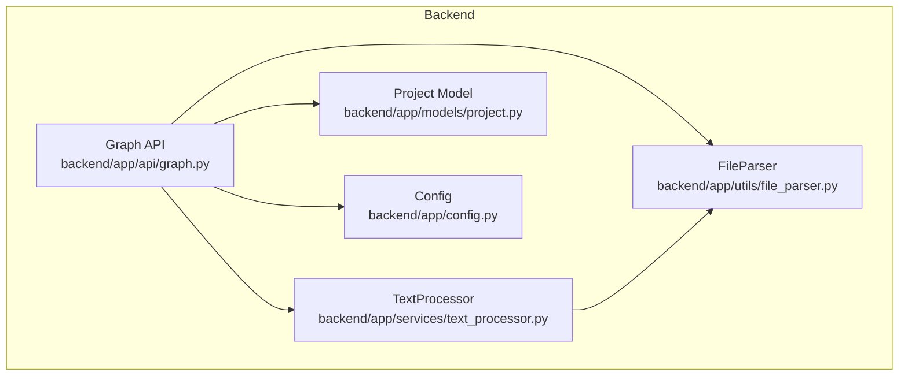
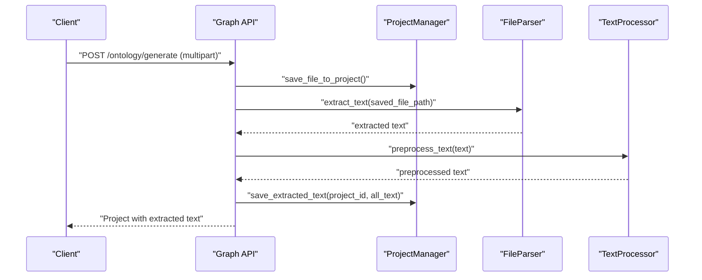
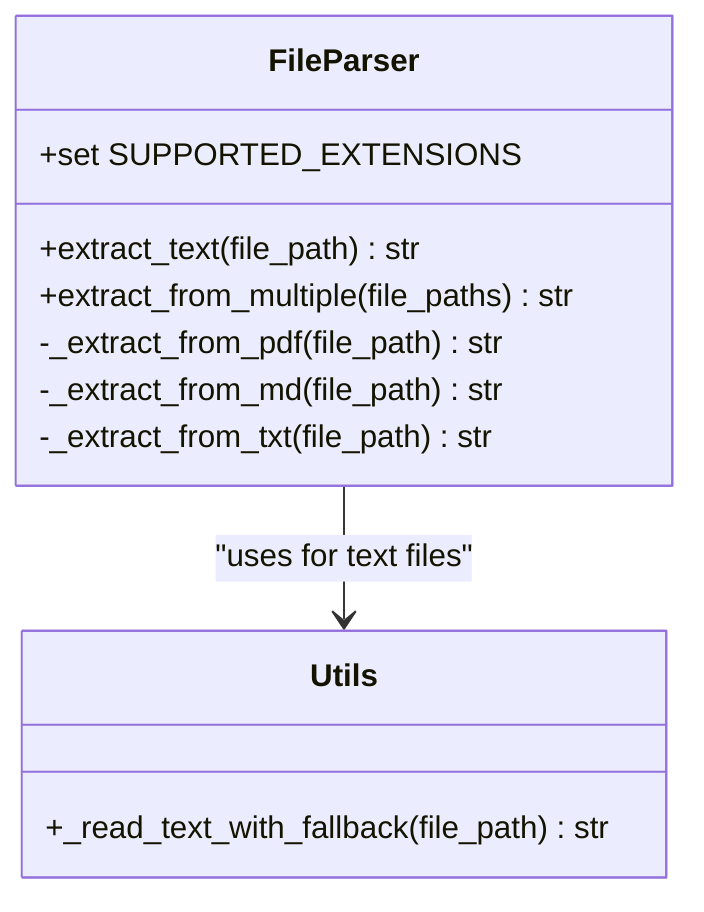
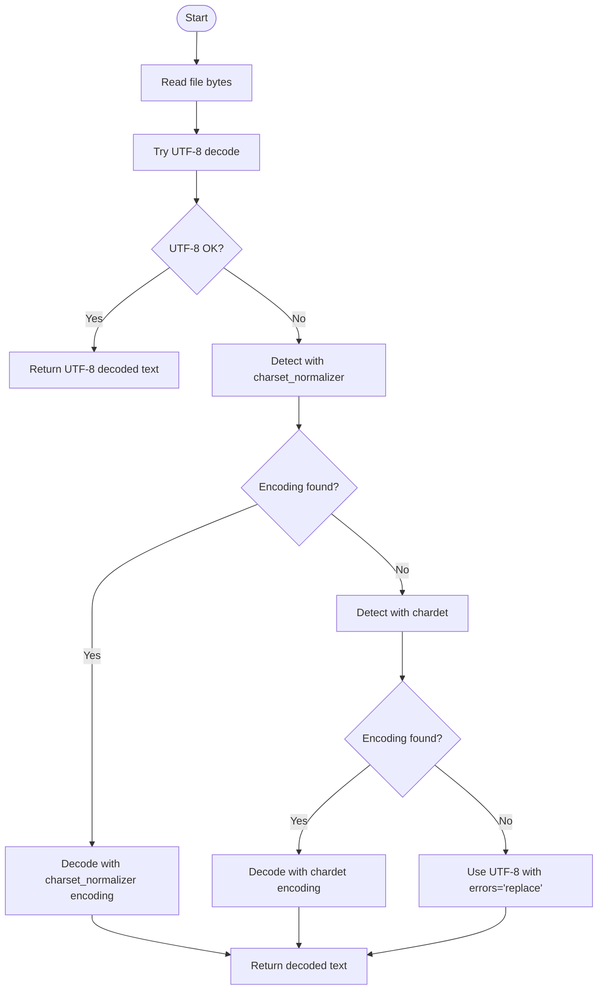
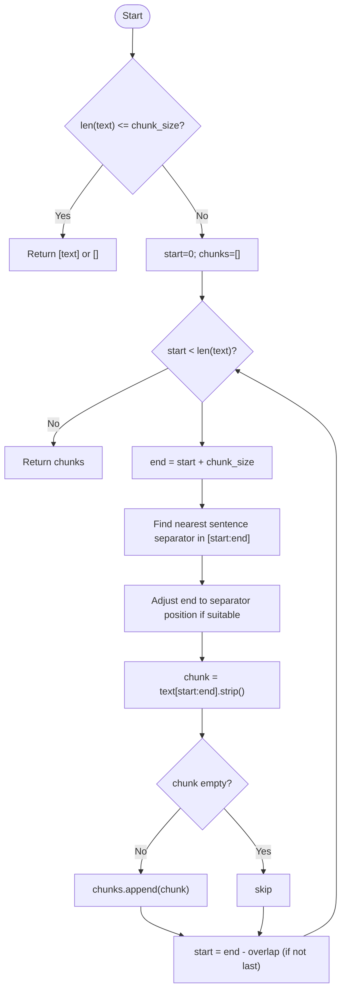
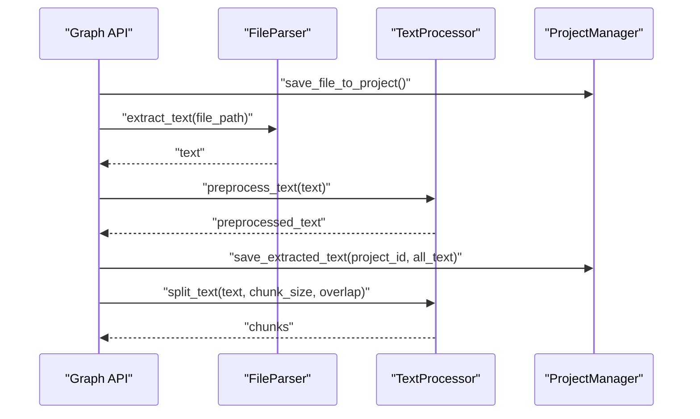
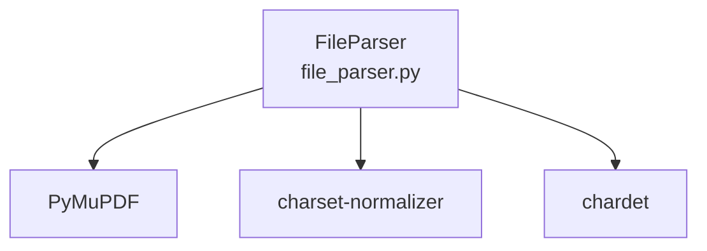

# File Processing Utilities

<cite>
**Referenced Files in This Document**
- [file_parser.py](file://backend/app/utils/file_parser.py)
- [text_processor.py](file://backend/app/services/text_processor.py)
- [graph.py](file://backend/app/api/graph.py)
- [config.py](file://backend/app/config.py)
- [project.py](file://backend/app/models/project.py)
- [requirements.txt](file://backend/requirements.txt)
- [pyproject.toml](file://backend/pyproject.toml)
</cite>

## Table of Contents
1. [Introduction](#introduction)
2. [Project Structure](#project-structure)
3. [Core Components](#core-components)
4. [Architecture Overview](#architecture-overview)
5. [Detailed Component Analysis](#detailed-component-analysis)
6. [Dependency Analysis](#dependency-analysis)
7. [Performance Considerations](#performance-considerations)
8. [Troubleshooting Guide](#troubleshooting-guide)
9. [Conclusion](#conclusion)
10. [Appendices](#appendices)

## Introduction
This document provides comprehensive documentation for the file processing utilities focused on the FileParser class and text extraction capabilities. It covers multi-format file support (PDF via PyMuPDF, Markdown, and TXT with automatic encoding detection), fallback encoding detection strategies using charset_normalizer and chardet, text chunking with configurable chunk size and overlap, and integration with the document ingestion pipeline. Practical examples illustrate single-file and multi-file processing, error handling for unsupported formats, and performance considerations for large documents.

## Project Structure
The file processing utilities reside under the backend application and integrate with the ingestion pipeline through API endpoints and services:
- File parsing utilities: backend/app/utils/file_parser.py
- Text processing service: backend/app/services/text_processor.py
- API endpoints orchestrating ingestion: backend/app/api/graph.py
- Configuration and defaults: backend/app/config.py
- Project persistence and file storage: backend/app/models/project.py
- Dependencies: backend/requirements.txt and backend/pyproject.toml

**Diagram sources**
- [file_parser.py:61-144](file://backend/app/utils/file_parser.py#L61-L144)
- [text_processor.py:9-34](file://backend/app/services/text_processor.py#L9-L34)
- [graph.py:15-20](file://backend/app/api/graph.py#L15-L20)
- [config.py:41-45](file://backend/app/config.py#L41-L45)
- [project.py:101-165](file://backend/app/models/project.py#L101-L165)

**Section sources**
- [file_parser.py:1-190](file://backend/app/utils/file_parser.py#L1-L190)
- [text_processor.py:1-72](file://backend/app/services/text_processor.py#L1-L72)
- [graph.py:1-604](file://backend/app/api/graph.py#L1-L604)
- [config.py:1-76](file://backend/app/config.py#L1-L76)
- [project.py:1-306](file://backend/app/models/project.py#L1-L306)

## Core Components
- FileParser: Extracts text from PDF, Markdown, and TXT files with robust encoding detection and multi-file merging.
- split_text_into_chunks: Splits text into chunks with configurable size and overlap, attempting sentence boundary alignment.
- TextProcessor: Bridges FileParser and downstream processing, offering preprocessing and chunking utilities.

Key responsibilities:
- FileParser.extract_text: Validates file existence and supported extensions, dispatches to format-specific extractors, and raises appropriate errors for unsupported formats.
- Encoding detection: Multi-level fallback using UTF-8, charset_normalizer, chardet, and a final UTF-8 with replacement strategy.
- TextProcessor.split_text: Delegates chunking to split_text_into_chunks with default parameters aligned to Config.
- Integration: API endpoints orchestrate file uploads, text extraction, preprocessing, and graph building.

**Section sources**
- [file_parser.py:61-144](file://backend/app/utils/file_parser.py#L61-L144)
- [file_parser.py:147-188](file://backend/app/utils/file_parser.py#L147-L188)
- [text_processor.py:9-34](file://backend/app/services/text_processor.py#L9-L34)
- [config.py:41-45](file://backend/app/config.py#L41-L45)

## Architecture Overview
The ingestion pipeline integrates file parsing with text processing and graph construction:
1. Upload files via API endpoint.
2. Save files to project storage and extract text using FileParser.
3. Preprocess text using TextProcessor.
4. Split text into chunks using split_text_into_chunks.
5. Build graph with chunked text and track progress.

**Diagram sources**
- [graph.py:174-212](file://backend/app/api/graph.py#L174-L212)
- [project.py:241-290](file://backend/app/models/project.py#L241-L290)
- [file_parser.py:67-94](file://backend/app/utils/file_parser.py#L67-L94)
- [text_processor.py:37-61](file://backend/app/services/text_processor.py#L37-L61)

## Detailed Component Analysis

### FileParser Class
The FileParser class centralizes multi-format text extraction:
- Supported formats: PDF (.pdf), Markdown (.md, .markdown), TXT (.txt).
- PDF extraction: Uses PyMuPDF to iterate pages and concatenate non-empty text blocks.
- Text extraction: Uses _read_text_with_fallback for MD and TXT files.
- Multi-file merging: extract_from_multiple aggregates multiple files with per-document headers and failure handling.

**Diagram sources**
- [file_parser.py:61-144](file://backend/app/utils/file_parser.py#L61-L144)
- [file_parser.py:11-58](file://backend/app/utils/file_parser.py#L11-L58)

**Section sources**
- [file_parser.py:61-144](file://backend/app/utils/file_parser.py#L61-L144)

### Encoding Detection Strategy
The _read_text_with_fallback function implements a multi-level fallback strategy:
1. Attempt UTF-8 decoding.
2. Use charset_normalizer to detect encoding.
3. Fallback to chardet if charset_normalizer fails.
4. Final fallback: decode with detected or UTF-8 and replace problematic characters.

**Diagram sources**
- [file_parser.py:11-58](file://backend/app/utils/file_parser.py#L11-L58)

**Section sources**
- [file_parser.py:11-58](file://backend/app/utils/file_parser.py#L11-L58)

### Text Chunking with Sentence Boundary Detection
The split_text_into_chunks function splits text into overlapping segments with sentence-aware boundaries:
- Parameters: chunk_size (default 500), overlap (default 50).
- Strategy: Attempt to end chunks at sentence delimiters (full-width and ASCII punctuation, line breaks).
- Overlap handling: Subsequent chunk starts at end - overlap to maintain continuity.

**Diagram sources**
- [file_parser.py:147-188](file://backend/app/utils/file_parser.py#L147-L188)

**Section sources**
- [file_parser.py:147-188](file://backend/app/utils/file_parser.py#L147-L188)
- [config.py:44-45](file://backend/app/config.py#L44-L45)

### Integration with Document Ingestion Pipeline
The ingestion pipeline integrates FileParser and TextProcessor:
- API endpoint saves uploaded files, extracts text per file, preprocesses, merges, and persists extracted text.
- Graph building endpoint retrieves persisted text, splits into chunks using TextProcessor, and creates the graph.

**Diagram sources**
- [graph.py:174-212](file://backend/app/api/graph.py#L174-L212)
- [text_processor.py:13-34](file://backend/app/services/text_processor.py#L13-L34)
- [project.py:275-290](file://backend/app/models/project.py#L275-L290)

**Section sources**
- [graph.py:174-212](file://backend/app/api/graph.py#L174-L212)
- [text_processor.py:13-34](file://backend/app/services/text_processor.py#L13-L34)
- [project.py:275-290](file://backend/app/models/project.py#L275-L290)

## Dependency Analysis
External dependencies required for file processing:
- PyMuPDF: PDF text extraction.
- charset-normalizer: Encoding detection for text files.
- chardet: Alternative encoding detection for text files.

**Diagram sources**
- [file_parser.py:97-121](file://backend/app/utils/file_parser.py#L97-L121)
- [requirements.txt:24-28](file://backend/requirements.txt#L24-L28)
- [pyproject.toml:28-32](file://backend/pyproject.toml#L28-L32)

**Section sources**
- [requirements.txt:24-28](file://backend/requirements.txt#L24-L28)
- [pyproject.toml:28-32](file://backend/pyproject.toml#L28-L32)

## Performance Considerations
- PDF processing: PyMuPDF reads pages sequentially; for very large PDFs, consider streaming and memory-efficient page iteration.
- Text extraction: _read_text_with_fallback performs multiple decoding attempts; charset_normalizer and chardet add overhead but improve reliability.
- Chunking: split_text_into_chunks iterates linearly; keep chunk_size balanced to avoid excessively small chunks that increase processing overhead.
- Memory management: Prefer incremental processing (streaming) for large files and avoid loading entire concatenated texts into memory when unnecessary.
- I/O: Persist extracted text early (ProjectManager.save_extracted_text) to minimize repeated processing and enable resumable workflows.

[No sources needed since this section provides general guidance]

## Troubleshooting Guide
Common issues and resolutions:
- Unsupported file format: FileParser raises ValueError for non-MD/Markdown/TXT/PDF files. Verify file extensions match supported formats.
- Missing PyMuPDF: Import error indicates missing dependency; install PyMuPDF as per requirements.
- Encoding errors: _read_text_with_fallback ensures decoding succeeds by trying multiple encodings and replacing problematic characters as a last resort.
- Empty or corrupted PDF: _extract_from_pdf concatenates non-empty page texts; verify PDF integrity and page availability.
- Multi-file failures: extract_from_multiple continues processing remaining files upon exceptions and records failures in merged output.

**Section sources**
- [file_parser.py:84-94](file://backend/app/utils/file_parser.py#L84-L94)
- [file_parser.py:101-102](file://backend/app/utils/file_parser.py#L101-L102)
- [file_parser.py:11-58](file://backend/app/utils/file_parser.py#L11-L58)
- [file_parser.py:134-144](file://backend/app/utils/file_parser.py#L134-L144)

## Conclusion
The file processing utilities provide a robust foundation for extracting text from PDF, Markdown, and TXT files with reliable encoding detection and flexible chunking. The integration with the ingestion pipeline enables scalable document processing workflows, supporting both single-file and multi-file scenarios while maintaining resilience against encoding and format issues.

[No sources needed since this section summarizes without analyzing specific files]

## Appendices

### Practical Usage Examples
- Single file extraction:
  - Use FileParser.extract_text(file_path) to extract text from a single supported file.
- Multiple files extraction:
  - Use FileParser.extract_from_multiple(file_paths) to merge multiple files with per-document headers and failure reporting.
- Text preprocessing and chunking:
  - Use TextProcessor.preprocess_text(text) to normalize whitespace and line breaks.
  - Use TextProcessor.split_text(text, chunk_size, overlap) to split into chunks with overlap.
- End-to-end ingestion:
  - Upload files via the API endpoint, which saves files, extracts text, preprocesses, and persists extracted content for later graph building.

**Section sources**
- [file_parser.py:67-94](file://backend/app/utils/file_parser.py#L67-L94)
- [file_parser.py:124-144](file://backend/app/utils/file_parser.py#L124-L144)
- [text_processor.py:13-34](file://backend/app/services/text_processor.py#L13-L34)
- [graph.py:174-212](file://backend/app/api/graph.py#L174-L212)