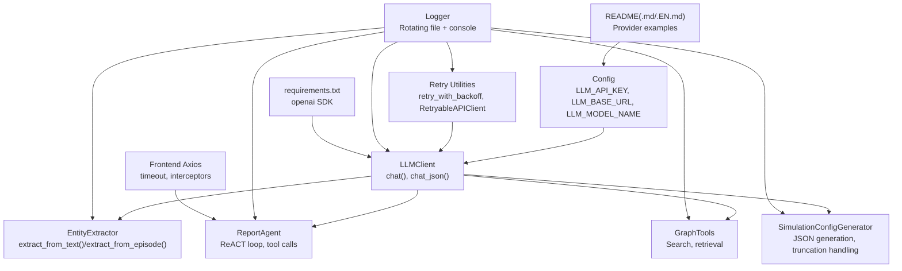
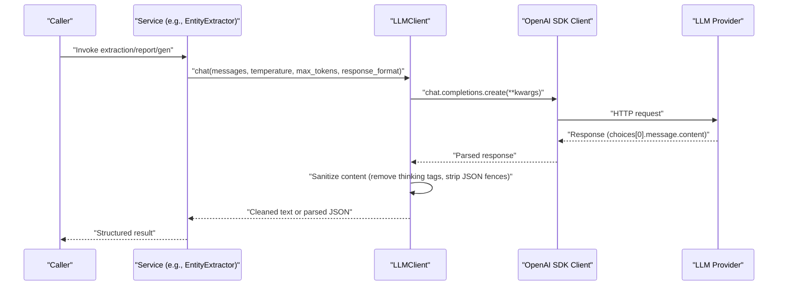
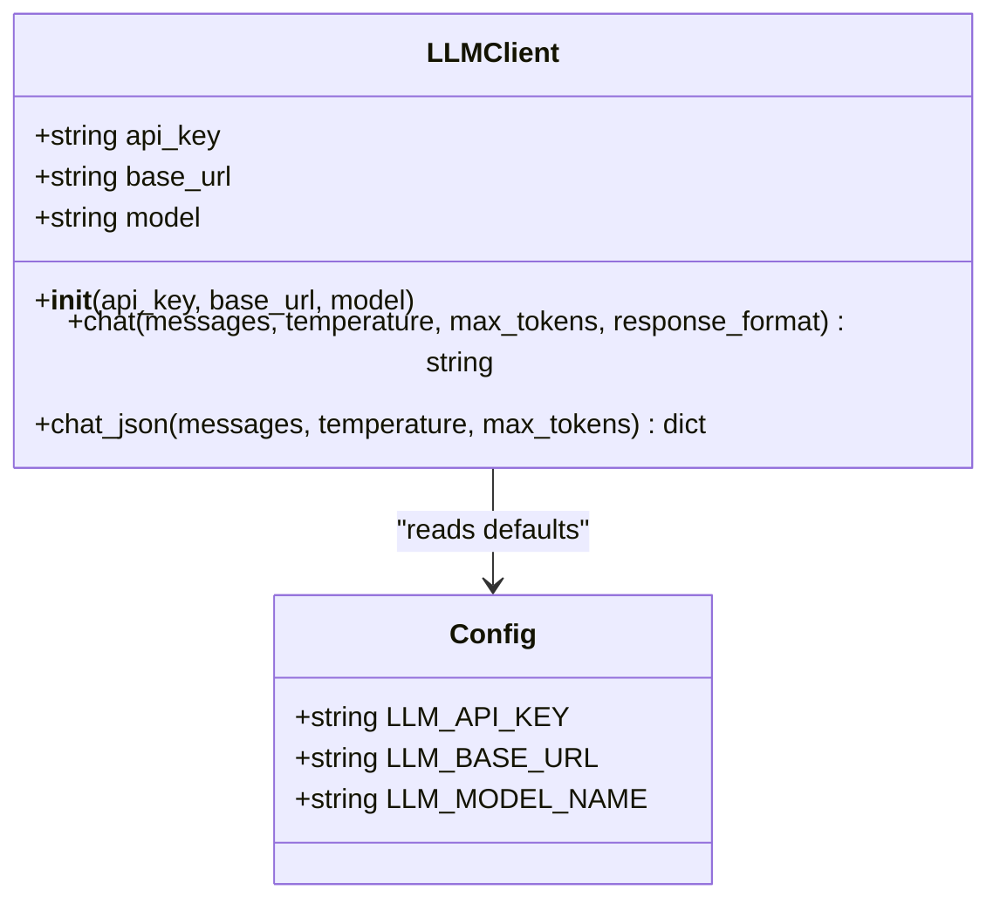
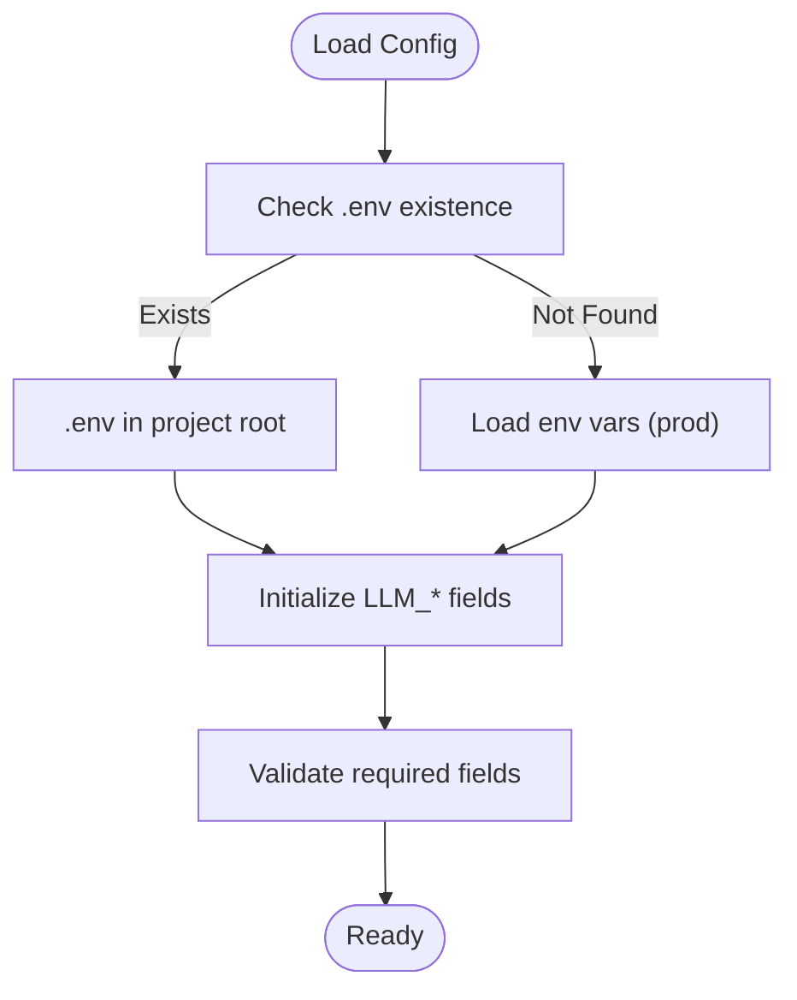
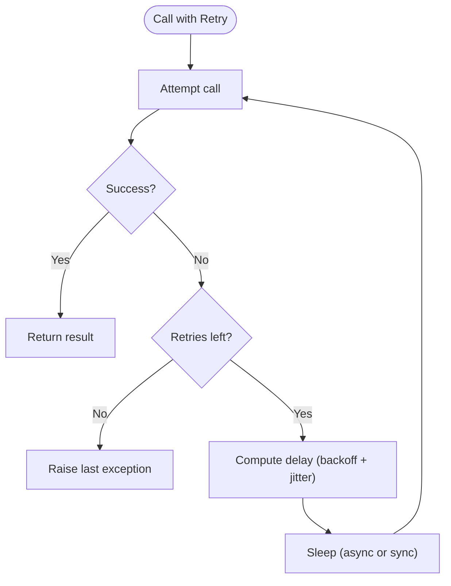
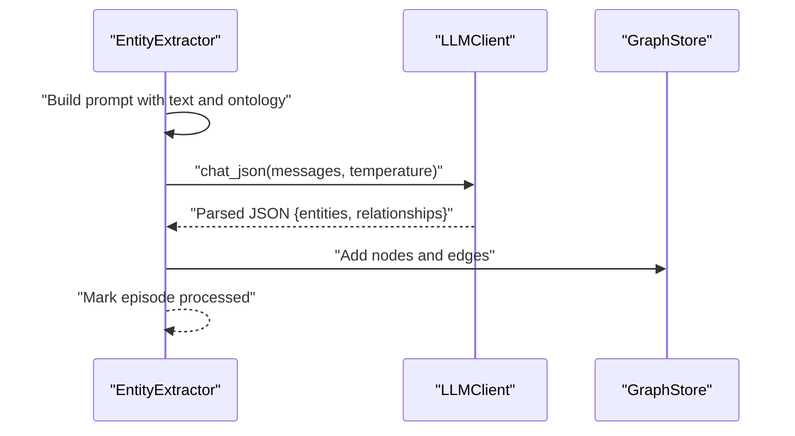
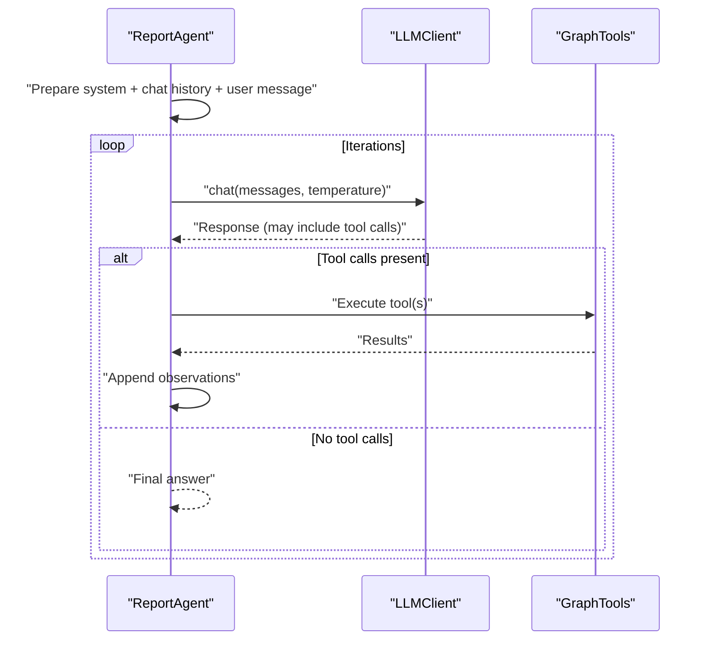
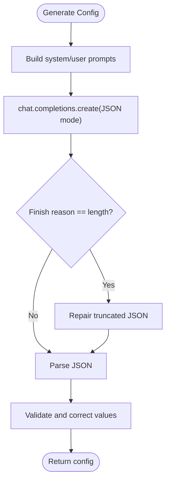
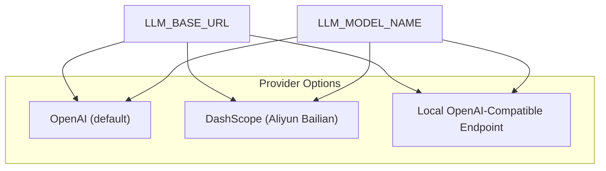
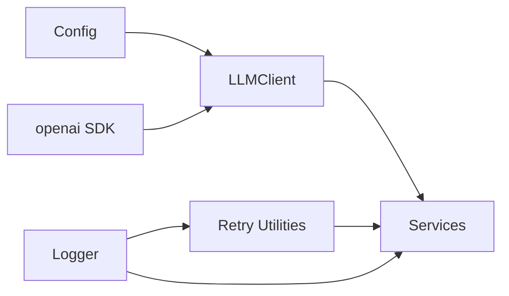

# LLM Client Integration

<cite>
**Referenced Files in This Document**
- [llm_client.py](file://backend/app/utils/llm_client.py)
- [retry.py](file://backend/app/utils/retry.py)
- [config.py](file://backend/app/config.py)
- [entity_extractor.py](file://backend/app/services/entity_extractor.py)
- [report_agent.py](file://backend/app/services/report_agent.py)
- [graph_tools.py](file://backend/app/services/graph_tools.py)
- [simulation_config_generator.py](file://backend/app/services/simulation_config_generator.py)
- [logger.py](file://backend/app/utils/logger.py)
- [requirements.txt](file://backend/requirements.txt)
- [README.md](file://README.md)
- [README-EN.md](file://README-EN.md)
- [run_parallel_simulation.py](file://backend/scripts/run_parallel_simulation.py)
- [index.js](file://frontend/src/api/index.js)
</cite>

## Table of Contents
1. [Introduction](#introduction)
2. [Project Structure](#project-structure)
3. [Core Components](#core-components)
4. [Architecture Overview](#architecture-overview)
5. [Detailed Component Analysis](#detailed-component-analysis)
6. [Dependency Analysis](#dependency-analysis)
7. [Performance Considerations](#performance-considerations)
8. [Troubleshooting Guide](#troubleshooting-guide)
9. [Conclusion](#conclusion)
10. [Appendices](#appendices)

## Introduction
This document explains the LLM client integration that provides unified access to various AI/ML providers through OpenAI SDK compatibility. It covers client initialization, configuration management, provider abstraction, request/response handling, parameter validation, error management, authentication, rate limiting, retry strategies, model parameter tuning, response formatting, streaming considerations, performance optimization, caching, and cost management. It also includes practical usage patterns, provider-specific configurations, and troubleshooting guidance.

## Project Structure
The LLM integration spans several modules:
- Configuration management centralizes environment variables and defaults.
- The LLM client wraps the OpenAI SDK to normalize provider calls.
- Services consume the LLM client for tasks like entity extraction, report generation, and simulation configuration.
- A robust retry utility supports both synchronous and asynchronous backoff strategies.
- Logging utilities standardize observability across LLM calls.
- Frontend Axios configuration sets timeouts and error handling for API requests.

**Diagram sources**
- [config.py:30-34](file://backend/app/config.py#L30-L34)
- [llm_client.py:14-104](file://backend/app/utils/llm_client.py#L14-L104)
- [entity_extractor.py:16-291](file://backend/app/services/entity_extractor.py#L16-L291)
- [report_agent.py:1809-1847](file://backend/app/services/report_agent.py#L1809-L1847)
- [graph_tools.py:1-200](file://backend/app/services/graph_tools.py#L1-L200)
- [simulation_config_generator.py:442-459](file://backend/app/services/simulation_config_generator.py#L442-L459)
- [retry.py:15-129](file://backend/app/utils/retry.py#L15-L129)
- [logger.py:30-127](file://backend/app/utils/logger.py#L30-L127)
- [requirements.txt:13-14](file://backend/requirements.txt#L13-L14)
- [README.md:101-112](file://README.md#L101-L112)
- [README-EN.md:101-112](file://README-EN.md#L101-L112)
- [index.js:1-67](file://frontend/src/api/index.js#L1-L67)

**Section sources**
- [config.py:30-34](file://backend/app/config.py#L30-L34)
- [llm_client.py:14-104](file://backend/app/utils/llm_client.py#L14-L104)
- [retry.py:15-129](file://backend/app/utils/retry.py#L15-L129)
- [logger.py:30-127](file://backend/app/utils/logger.py#L30-L127)
- [requirements.txt:13-14](file://backend/requirements.txt#L13-L14)
- [README.md:101-112](file://README.md#L101-L112)
- [README-EN.md:101-112](file://README-EN.md#L101-L112)
- [index.js:1-67](file://frontend/src/api/index.js#L1-L67)

## Core Components
- LLMClient: Thin wrapper around the OpenAI SDK client, exposing chat and JSON-returning methods with standardized parameters and response cleanup.
- Configuration: Centralized environment-driven configuration for API keys, base URLs, and model names.
- Retry Utilities: Exponential backoff with jitter and batch retry helpers for resilient LLM calls.
- Logging: Structured logging to file and console with UTF-8 support and rotating handlers.
- Services: Entity extraction, report generation, graph tools, and simulation configuration generation that depend on the LLM client.

Key responsibilities:
- Unified provider access via OpenAI SDK compatibility.
- Parameter normalization (temperature, max_tokens, response_format).
- Response sanitization (removing provider-specific thinking tags, stripping JSON code fences).
- Robust error handling and logging.

**Section sources**
- [llm_client.py:14-104](file://backend/app/utils/llm_client.py#L14-L104)
- [config.py:30-34](file://backend/app/config.py#L30-L34)
- [retry.py:15-129](file://backend/app/utils/retry.py#L15-L129)
- [logger.py:30-127](file://backend/app/utils/logger.py#L30-L127)

## Architecture Overview
The LLM integration follows a layered design:
- Provider Abstraction: LLMClient encapsulates provider differences behind a consistent interface.
- Configuration Layer: Reads environment variables and provides defaults.
- Service Layer: Uses LLMClient for inference, with specialized prompts and workflows.
- Resilience Layer: Retry utilities wrap critical calls.
- Observability Layer: Logging captures detailed traces and summaries.

**Diagram sources**
- [llm_client.py:35-104](file://backend/app/utils/llm_client.py#L35-L104)
- [entity_extractor.py:50-57](file://backend/app/services/entity_extractor.py#L50-L57)
- [report_agent.py:1827-1844](file://backend/app/services/report_agent.py#L1827-L1844)

## Detailed Component Analysis

### LLMClient
- Initialization: Accepts optional overrides for API key, base URL, and model; falls back to configuration.
- Authentication: Requires LLM_API_KEY; raises an error if missing.
- Methods:
  - chat(): Sends messages with temperature, max_tokens, optional response_format; returns sanitized text.
  - chat_json(): Requests JSON mode, strips markdown code fences, parses JSON, raises on invalid JSON.
- Response cleanup:
  - Removes provider-specific thinking content blocks.
  - Strips JSON code block markers for cleaner parsing.

**Diagram sources**
- [llm_client.py:14-104](file://backend/app/utils/llm_client.py#L14-L104)
- [config.py:30-34](file://backend/app/config.py#L30-L34)

**Section sources**
- [llm_client.py:14-104](file://backend/app/utils/llm_client.py#L14-L104)
- [config.py:30-34](file://backend/app/config.py#L30-L34)

### Configuration Management
- Loads .env from project root with fallback to environment variables.
- Provides unified LLM configuration fields:
  - LLM_API_KEY
  - LLM_BASE_URL (defaults to OpenAI-compatible endpoint)
  - LLM_MODEL_NAME (defaults to a small model)
- Validates required configuration and returns errors for missing keys.

**Diagram sources**
- [config.py:9-17](file://backend/app/config.py#L9-L17)
- [config.py:30-74](file://backend/app/config.py#L30-L74)

**Section sources**
- [config.py:9-17](file://backend/app/config.py#L9-L17)
- [config.py:30-74](file://backend/app/config.py#L30-L74)

### Retry Strategies
- Decorators:
  - retry_with_backoff: Synchronous exponential backoff with jitter and optional on_retry callback.
  - retry_with_backoff_async: Asynchronous variant using asyncio.sleep.
- RetryableAPIClient:
  - call_with_retry: Executes a callable with retry and bounded delay.
  - call_batch_with_retry: Processes a list of items with per-item retry; continues on failure if configured.

**Diagram sources**
- [retry.py:15-129](file://backend/app/utils/retry.py#L15-L129)
- [retry.py:132-238](file://backend/app/utils/retry.py#L132-L238)

**Section sources**
- [retry.py:15-129](file://backend/app/utils/retry.py#L15-L129)
- [retry.py:132-238](file://backend/app/utils/retry.py#L132-L238)

### Logging
- Ensures UTF-8 output on Windows consoles.
- Creates rotating file logs and concise console logs.
- Provides convenience methods for standard log levels.

**Section sources**
- [logger.py:13-127](file://backend/app/utils/logger.py#L13-L127)

### Service Integrations

#### EntityExtractor
- Uses LLMClient.chat_json to extract entities and relationships in JSON format.
- Builds structured prompts with optional ontology hints.
- Stores results in a graph store and marks episodes as processed.

**Diagram sources**
- [entity_extractor.py:47-167](file://backend/app/services/entity_extractor.py#L47-L167)
- [llm_client.py:70-104](file://backend/app/utils/llm_client.py#L70-L104)

**Section sources**
- [entity_extractor.py:16-291](file://backend/app/services/entity_extractor.py#L16-L291)
- [llm_client.py:70-104](file://backend/app/utils/llm_client.py#L70-L104)

#### ReportAgent
- Implements a ReACT-like loop with tool calls and LLM responses.
- Uses LLMClient.chat for iterative reasoning and tool invocation.
- Logs detailed agent actions to JSONL and console logs.

**Diagram sources**
- [report_agent.py:1809-1847](file://backend/app/services/report_agent.py#L1809-L1847)
- [graph_tools.py:1-200](file://backend/app/services/graph_tools.py#L1-L200)

**Section sources**
- [report_agent.py:1809-1847](file://backend/app/services/report_agent.py#L1809-L1847)
- [graph_tools.py:1-200](file://backend/app/services/graph_tools.py#L1-L200)

#### SimulationConfigGenerator
- Generates complex simulation parameters using LLM with JSON mode.
- Handles truncation and JSON repair for long outputs.
- Applies temperature decay on retries to stabilize outputs.

**Diagram sources**
- [simulation_config_generator.py:442-459](file://backend/app/services/simulation_config_generator.py#L442-L459)
- [simulation_config_generator.py:482-492](file://backend/app/services/simulation_config_generator.py#L482-L492)

**Section sources**
- [simulation_config_generator.py:442-459](file://backend/app/services/simulation_config_generator.py#L442-L459)
- [simulation_config_generator.py:482-492](file://backend/app/services/simulation_config_generator.py#L482-L492)

### Provider Abstraction and Multi-Provider Support
- OpenAI SDK compatibility enables swapping providers by changing base URL and model.
- README documents using OpenAI-compatible endpoints (e.g., Alibaba Bailian) with custom base URLs and model names.
- Scripts demonstrate dual LLM configuration for parallel simulation to improve concurrency across platforms.

**Diagram sources**
- [README.md:101-112](file://README.md#L101-L112)
- [README-EN.md:101-112](file://README-EN.md#L101-L112)
- [run_parallel_simulation.py:984-1037](file://backend/scripts/run_parallel_simulation.py#L984-L1037)

**Section sources**
- [README.md:101-112](file://README.md#L101-L112)
- [README-EN.md:101-112](file://README-EN.md#L101-L112)
- [run_parallel_simulation.py:984-1037](file://backend/scripts/run_parallel_simulation.py#L984-L1037)

## Dependency Analysis
- LLMClient depends on:
  - OpenAI SDK for HTTP calls.
  - Config for credentials and defaults.
- Services depend on LLMClient for inference and on GraphStore for persistence.
- Retry utilities are independent and can wrap any callable.
- Logging is used across all modules for observability.

**Diagram sources**
- [requirements.txt:13-14](file://backend/requirements.txt#L13-L14)
- [config.py:30-34](file://backend/app/config.py#L30-L34)
- [llm_client.py:14-104](file://backend/app/utils/llm_client.py#L14-L104)
- [retry.py:15-129](file://backend/app/utils/retry.py#L15-L129)
- [logger.py:30-127](file://backend/app/utils/logger.py#L30-L127)

**Section sources**
- [requirements.txt:13-14](file://backend/requirements.txt#L13-L14)
- [config.py:30-34](file://backend/app/config.py#L30-L34)
- [llm_client.py:14-104](file://backend/app/utils/llm_client.py#L14-L104)
- [retry.py:15-129](file://backend/app/utils/retry.py#L15-L129)
- [logger.py:30-127](file://backend/app/utils/logger.py#L30-L127)

## Performance Considerations
- Token limits: Use max_tokens to bound output sizes and reduce latency and cost.
- Temperature tuning: Lower temperature for deterministic outputs (e.g., JSON generation).
- Prompt engineering: Provide clear JSON schemas and constraints to reduce retries.
- Streaming: The current implementation uses standard completions; streaming is not enabled in the referenced code.
- Concurrency: Dual LLM configuration in scripts allows parallelism across providers/platforms.
- Cost control: Monitor model selection and token usage; prefer smaller models for routine tasks.

[No sources needed since this section provides general guidance]

## Troubleshooting Guide
Common issues and resolutions:
- Missing LLM_API_KEY:
  - Symptom: Initialization error indicating missing configuration.
  - Resolution: Set LLM_API_KEY in .env or environment variables.
- Invalid JSON from LLM:
  - Symptom: JSON decode errors when parsing chat_json responses.
  - Resolution: Enable JSON mode, strip code fences, and apply retry with temperature decay.
- Truncated outputs:
  - Symptom: Length-limited responses requiring repair.
  - Resolution: Detect finish_reason length and repair/truncate JSON safely.
- Provider-specific thinking tags:
  - Symptom: Extra reasoning content in responses.
  - Resolution: Sanitize using regex removal before parsing.
- Network timeouts and intermittent failures:
  - Symptom: Transient errors during LLM calls.
  - Resolution: Wrap calls with retry decorators/backoff; adjust delays and jitter.
- Frontend timeouts:
  - Symptom: Axios timeout errors for long-running tasks.
  - Resolution: Increase request timeout in frontend; implement client-side retries.

**Section sources**
- [llm_client.py:27-28](file://backend/app/utils/llm_client.py#L27-L28)
- [llm_client.py:99-102](file://backend/app/utils/llm_client.py#L99-L102)
- [simulation_config_generator.py:457-459](file://backend/app/services/simulation_config_generator.py#L457-L459)
- [simulation_config_generator.py:482-492](file://backend/app/services/simulation_config_generator.py#L482-L492)
- [retry.py:15-129](file://backend/app/utils/retry.py#L15-L129)
- [index.js:1-67](file://frontend/src/api/index.js#L1-L67)

## Conclusion
The LLM client integration provides a robust, provider-agnostic layer built on the OpenAI SDK. It standardizes configuration, request/response handling, and error management while enabling flexible model selection and multi-provider deployments. Combined with retry strategies, structured logging, and service-specific workflows, it supports reliable and scalable AI-powered features such as entity extraction, report generation, and simulation configuration.

[No sources needed since this section summarizes without analyzing specific files]

## Appendices

### API Usage Patterns
- Chat with structured JSON:
  - Use chat_json with response_format set to JSON mode.
  - Sanitize and parse the returned JSON.
- ReACT-style loops:
  - Alternate between LLM reasoning and tool execution.
  - Limit chat history and iterations to control cost and latency.
- Batch processing:
  - Use RetryableAPIClient.call_batch_with_retry for resilient bulk operations.

**Section sources**
- [llm_client.py:70-104](file://backend/app/utils/llm_client.py#L70-L104)
- [report_agent.py:1809-1847](file://backend/app/services/report_agent.py#L1809-L1847)
- [retry.py:195-238](file://backend/app/utils/retry.py#L195-L238)

### Response Formatting and Streaming
- Response formatting:
  - Use response_format for JSON mode.
  - Strip markdown code fences and provider-specific tags.
- Streaming:
  - Not implemented in the referenced code; consider enabling streaming for long-form generation if needed.

**Section sources**
- [llm_client.py:61-62](file://backend/app/utils/llm_client.py#L61-L62)
- [llm_client.py:94-96](file://backend/app/utils/llm_client.py#L94-L96)

### Authentication and Rate Limiting
- Authentication:
  - LLM_API_KEY is mandatory; set via .env or environment variables.
- Rate limiting:
  - Not explicitly handled in code; implement provider-specific quotas and backoff strategies.
  - Use retry_with_backoff to mitigate transient throttling.

**Section sources**
- [config.py:30-34](file://backend/app/config.py#L30-L34)
- [retry.py:15-129](file://backend/app/utils/retry.py#L15-L129)

### Model Parameters and Tuning
- Temperature: Lower for deterministic outputs (e.g., JSON).
- Max tokens: Control output length to manage cost and latency.
- Response format: Use JSON mode for structured outputs.
- Model selection: Choose models via LLM_MODEL_NAME; swap providers via LLM_BASE_URL.

**Section sources**
- [llm_client.py:38-39](file://backend/app/utils/llm_client.py#L38-L39)
- [llm_client.py:40-62](file://backend/app/utils/llm_client.py#L40-L62)
- [config.py:30-34](file://backend/app/config.py#L30-L34)

### Cost Management
- Prefer smaller, cheaper models for routine tasks.
- Use JSON mode to reduce ambiguity and retries.
- Monitor token usage and set conservative max_tokens.
- Apply truncation and repair strategies to avoid oversized outputs.

[No sources needed since this section provides general guidance]