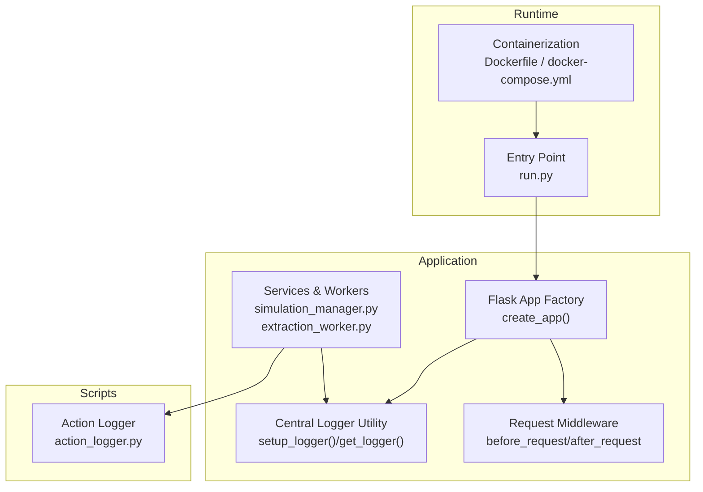
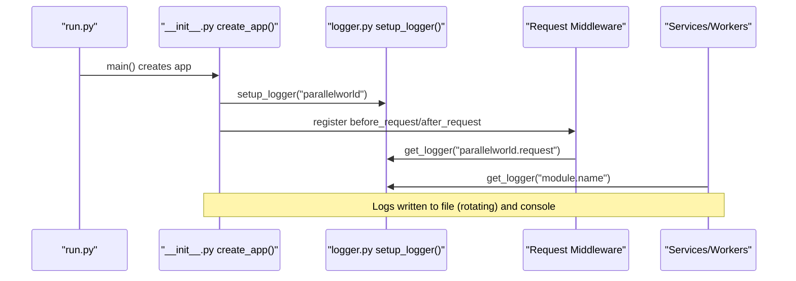
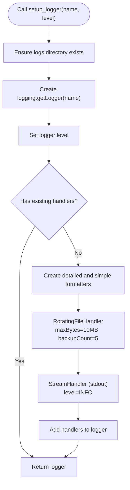
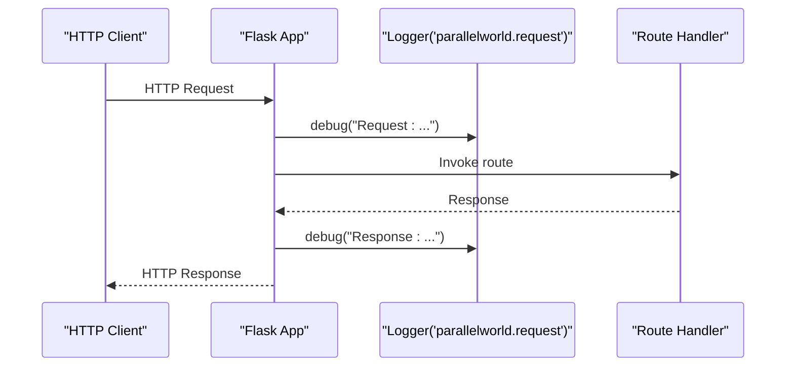
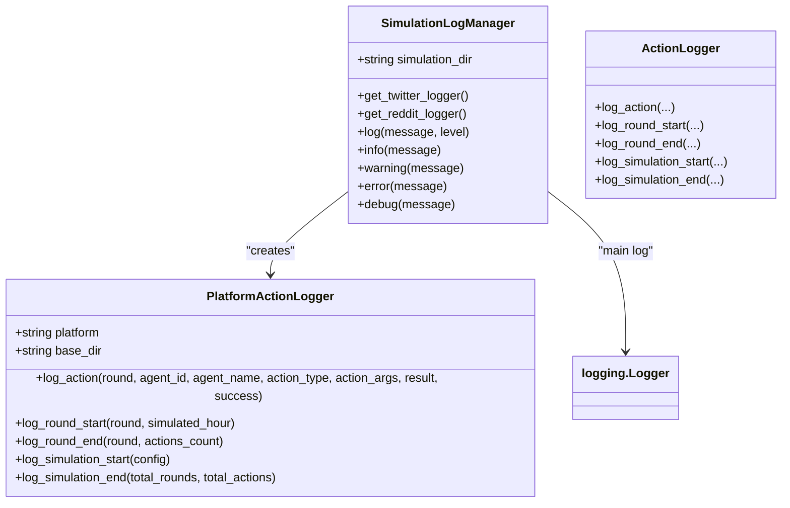
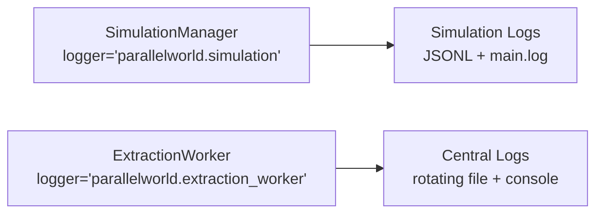
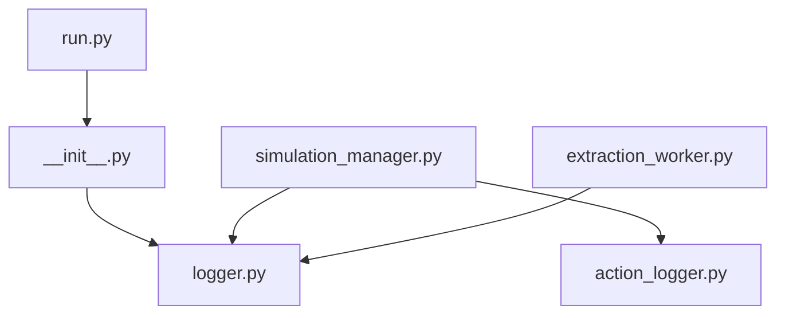

# Logging and Monitoring System

<cite>
**Referenced Files in This Document**
- [logger.py](file://backend/app/utils/logger.py)
- [__init__.py](file://backend/app/__init__.py)
- [action_logger.py](file://backend/scripts/action_logger.py)
- [simulation_manager.py](file://backend/app/services/simulation_manager.py)
- [extraction_worker.py](file://backend/app/services/extraction_worker.py)
- [run.py](file://backend/run.py)
- [Dockerfile](file://Dockerfile)
- [docker-compose.yml](file://docker-compose.yml)
</cite>

## Table of Contents
1. [Introduction](#introduction)
2. [Project Structure](#project-structure)
3. [Core Components](#core-components)
4. [Architecture Overview](#architecture-overview)
5. [Detailed Component Analysis](#detailed-component-analysis)
6. [Dependency Analysis](#dependency-analysis)
7. [Performance Considerations](#performance-considerations)
8. [Troubleshooting Guide](#troubleshooting-guide)
9. [Conclusion](#conclusion)
10. [Appendices](#appendices)

## Introduction
This document describes the logging and monitoring system used across the backend application. It covers structured logging configuration, log levels, formatting patterns, logging hierarchy, module-specific loggers, and centralized logging strategies. It also explains how the system integrates with monitoring and log aggregation, outlines alerting mechanisms, and provides best practices for debugging, error tracking, and performance metrics collection. Security considerations for sensitive data handling and log filtering strategies are included, along with examples of structured logging for different components and integration points with external monitoring tools.

## Project Structure
The logging and monitoring system spans several modules:
- Centralized logging utilities for the Flask application
- Structured action logging for OASIS simulations
- Module-specific loggers for services and workers
- Containerization and runtime configuration affecting logging behavior

**Diagram sources**
- [__init__.py:20-99](file://backend/app/__init__.py#L20-L99)
- [logger.py:30-127](file://backend/app/utils/logger.py#L30-L127)
- [action_logger.py:199-306](file://backend/scripts/action_logger.py#L199-L306)
- [simulation_manager.py:114-123](file://backend/app/services/simulation_manager.py#L114-L123)
- [extraction_worker.py:16-13](file://backend/app/services/extraction_worker.py#L16-L13)
- [run.py:25-51](file://backend/run.py#L25-L51)
- [Dockerfile:1-30](file://Dockerfile#L1-L30)
- [docker-compose.yml:1-38](file://docker-compose.yml#L1-L38)

**Section sources**
- [__init__.py:20-99](file://backend/app/__init__.py#L20-L99)
- [logger.py:30-127](file://backend/app/utils/logger.py#L30-L127)
- [action_logger.py:199-306](file://backend/scripts/action_logger.py#L199-L306)
- [simulation_manager.py:114-123](file://backend/app/services/simulation_manager.py#L114-L123)
- [extraction_worker.py:16-13](file://backend/app/services/extraction_worker.py#L16-L13)
- [run.py:25-51](file://backend/run.py#L25-L51)
- [Dockerfile:1-30](file://Dockerfile#L1-L30)
- [docker-compose.yml:1-38](file://docker-compose.yml#L1-L38)

## Core Components
- Central logger utility: Provides a unified logging setup with rotating file handlers and console output, ensuring UTF-8 encoding and avoiding duplicate logs.
- Flask application logger: Initializes logging early in the app lifecycle, sets up request logging middleware, and logs startup and error events.
- Simulation action logger: Writes structured JSONL entries for platform actions and simulation lifecycle events, complemented by a main simulation log.
- Service and worker loggers: Modules use module-specific logger names to isolate logs by component.

Key characteristics:
- Log levels: DEBUG for file, INFO for console; service components use appropriate levels for operational visibility.
- Formatting: Detailed format for file logs; concise format for console logs; structured JSONL for simulation action logs.
- Rotation and retention: Rotating file handler with fixed size and backup count; logs directory managed centrally.

**Section sources**
- [logger.py:30-127](file://backend/app/utils/logger.py#L30-L127)
- [__init__.py:30-76](file://backend/app/__init__.py#L30-L76)
- [action_logger.py:22-197](file://backend/scripts/action_logger.py#L22-L197)
- [simulation_manager.py:21-21](file://backend/app/services/simulation_manager.py#L21-L21)
- [extraction_worker.py:13-13](file://backend/app/services/extraction_worker.py#L13-L13)

## Architecture Overview
The logging architecture combines centralized logging for the Flask app with specialized logging for simulation actions. The central logger ensures consistent formatting and output targets, while service modules use module-scoped loggers. Simulation logs are written to dedicated JSONL files and a main simulation log, enabling downstream monitoring and analytics.

**Diagram sources**
- [run.py:25-51](file://backend/run.py#L25-L51)
- [__init__.py:30-76](file://backend/app/__init__.py#L30-L76)
- [logger.py:30-108](file://backend/app/utils/logger.py#L30-L108)

## Detailed Component Analysis

### Central Logger Utility
- Purpose: Provide a single, reusable logger with rotating file handler and console handler.
- Features:
  - Ensures UTF-8 output on Windows consoles.
  - Creates a logs directory if missing.
  - Prevents propagation to root logger to avoid duplicates.
  - Uses detailed formatter for file logs and concise formatter for console logs.
  - File rotation: 10 MB max size with 5 backups.
- Usage pattern: Call setup_logger(name, level) or get_logger(name) to obtain a module-scoped logger.

**Diagram sources**
- [logger.py:30-88](file://backend/app/utils/logger.py#L30-L88)

**Section sources**
- [logger.py:30-127](file://backend/app/utils/logger.py#L30-L127)

### Flask Application Logger and Request Middleware
- Initialization: The Flask app factory initializes the central logger and logs startup messages.
- Request logging: before_request logs method/path and request JSON; after_request logs response status.
- Startup and error logging: Database initialization and cleanup registration are logged with appropriate levels.

**Diagram sources**
- [__init__.py:64-75](file://backend/app/__init__.py#L64-L75)
- [logger.py:91-104](file://backend/app/utils/logger.py#L91-L104)

**Section sources**
- [__init__.py:30-96](file://backend/app/__init__.py#L30-L96)

### Simulation Action Logger and Manager
- PlatformActionLogger: Writes structured JSONL entries for actions, round events, and simulation lifecycle events for each platform (Twitter/Reddit).
- SimulationLogManager: Manages a main simulation log with separate file and console handlers, plus convenience methods for logging levels.
- Backward compatibility: Legacy ActionLogger interface remains available.

**Diagram sources**
- [action_logger.py:22-197](file://backend/scripts/action_logger.py#L22-L197)
- [action_logger.py:199-306](file://backend/scripts/action_logger.py#L199-L306)

**Section sources**
- [action_logger.py:22-197](file://backend/scripts/action_logger.py#L22-L197)
- [action_logger.py:199-306](file://backend/scripts/action_logger.py#L199-L306)

### Service and Worker Loggers
- SimulationManager: Uses a module-scoped logger named for the simulation domain.
- ExtractionWorker: Uses a module-scoped logger for extraction-related events and errors.

**Diagram sources**
- [simulation_manager.py:21-21](file://backend/app/services/simulation_manager.py#L21-L21)
- [extraction_worker.py:13-13](file://backend/app/services/extraction_worker.py#L13-L13)
- [logger.py:30-88](file://backend/app/utils/logger.py#L30-L88)

**Section sources**
- [simulation_manager.py:21-21](file://backend/app/services/simulation_manager.py#L21-L21)
- [extraction_worker.py:13-13](file://backend/app/services/extraction_worker.py#L13-L13)

## Dependency Analysis
- Central logger dependency: The Flask app factory depends on the logger utility for initialization.
- Service dependencies: Services and workers depend on the logger utility via get_logger to create module-specific loggers.
- Simulation logging dependency: Simulation managers and runners depend on the action logger for structured event logging.
- Runtime dependencies: The entry point script configures UTF-8 for console output before importing the app.

**Diagram sources**
- [run.py:25-51](file://backend/run.py#L25-L51)
- [__init__.py:30-76](file://backend/app/__init__.py#L30-L76)
- [logger.py:30-127](file://backend/app/utils/logger.py#L30-L127)
- [simulation_manager.py:21-21](file://backend/app/services/simulation_manager.py#L21-L21)
- [extraction_worker.py:13-13](file://backend/app/services/extraction_worker.py#L13-L13)
- [action_logger.py:199-306](file://backend/scripts/action_logger.py#L199-L306)

**Section sources**
- [run.py:25-51](file://backend/run.py#L25-L51)
- [__init__.py:30-76](file://backend/app/__init__.py#L30-L76)
- [logger.py:30-127](file://backend/app/utils/logger.py#L30-L127)
- [simulation_manager.py:21-21](file://backend/app/services/simulation_manager.py#L21-L21)
- [extraction_worker.py:13-13](file://backend/app/services/extraction_worker.py#L13-L13)
- [action_logger.py:199-306](file://backend/scripts/action_logger.py#L199-L306)

## Performance Considerations
- Log volume: Rotating file handler limits per-file size; choose appropriate backupCount for disk usage.
- Encoding overhead: UTF-8 reconfiguration avoids rendering issues but adds minimal startup cost.
- Handler duplication: Central logger prevents duplicate logs by disabling propagation and checking existing handlers.
- Request logging: Logging request bodies may increase log volume; consider sampling or sanitization for high-throughput APIs.
- Simulation logs: JSONL writes are append-only; ensure adequate disk space for long-running simulations.

[No sources needed since this section provides general guidance]

## Troubleshooting Guide
- Missing logs directory: The logger utility creates the logs directory automatically; verify permissions if logs are not written.
- Duplicate logs: The logger disables propagation; ensure no manual handler addition duplicates output.
- Console encoding issues: The logger and entry point reconfigure UTF-8 on Windows; confirm environment settings if garbled characters appear.
- Simulation logs not appearing: Verify simulation directory creation and file paths; ensure SimulationLogManager handlers are initialized.
- Error visibility: Use appropriate log levels (error/warning/info/debug) to surface issues; include contextual information in messages.

**Section sources**
- [logger.py:41-49](file://backend/app/utils/logger.py#L41-L49)
- [logger.py:78-82](file://backend/app/utils/logger.py#L78-L82)
- [action_logger.py:140-167](file://backend/scripts/action_logger.py#L140-L167)

## Conclusion
The logging and monitoring system provides a robust, centralized foundation with module-specific loggers and structured simulation logging. It balances verbosity and performance, supports UTF-8 environments, and enables downstream monitoring through JSONL and rotating file logs. Integrating with external monitoring tools involves aggregating the rotating log files and JSONL outputs, while leveraging structured formats for parsing and alerting.

[No sources needed since this section summarizes without analyzing specific files]

## Appendices

### Log Levels and Formatting Patterns
- Central logger:
  - File: Detailed format with timestamp, level, logger name, function name, line number, and message.
  - Console: Concise format with timestamp, level, and message.
- Simulation logs:
  - PlatformActionLogger: JSONL entries with fields for round, timestamp, agent identifiers, action type, arguments, result, and success flag.
  - SimulationLogManager: Main log with timestamp, level, and message.

**Section sources**
- [logger.py:55-82](file://backend/app/utils/logger.py#L55-L82)
- [action_logger.py:54-66](file://backend/scripts/action_logger.py#L54-L66)
- [action_logger.py:152-165](file://backend/scripts/action_logger.py#L152-L165)

### Log Rotation Policies and Storage Management
- Rotation policy: 10 MB per file with 5 backup files.
- Storage location: Logs directory created adjacent to the logger module; ensure sufficient disk space for production workloads.

**Section sources**
- [logger.py:67-75](file://backend/app/utils/logger.py#L67-L75)
- [logger.py:27-27](file://backend/app/utils/logger.py#L27-L27)

### Integration with Monitoring Systems and Alerting
- Log aggregation: Collect rotating log files and JSONL outputs for ingestion into log aggregation platforms.
- Structured parsing: Use JSONL fields for filtering and alerting on action outcomes and simulation events.
- Alerting hooks: Define alerts on error/warning levels and simulation failure events; monitor disk usage for rotation thresholds.

[No sources needed since this section provides general guidance]

### Security Considerations and Log Filtering Strategies
- Sensitive data handling: Avoid logging credentials, tokens, or personal data; sanitize or redact fields before logging.
- Filtering strategies: Implement pre-processing to remove sensitive keys; consider log masking and structured redaction in JSONL entries.
- Access control: Restrict access to logs directory and ensure secure transport for log aggregation.

[No sources needed since this section provides general guidance]

### Debugging Workflows and Best Practices
- Debug information capture: Use debug-level logs for detailed traces; include contextual identifiers (e.g., simulation_id, graph_id).
- Error tracking: Log exceptions with stack traces; maintain error fields in structured logs for downstream analysis.
- Performance metrics: Record timing around major operations; correlate with simulation round events for throughput analysis.
- Example patterns:
  - Central logger usage: Obtain module-scoped logger via get_logger and emit info/warning/error as appropriate.
  - Simulation logging: Use SimulationLogManager for lifecycle events and PlatformActionLogger for action records.

**Section sources**
- [logger.py:91-104](file://backend/app/utils/logger.py#L91-L104)
- [simulation_manager.py:444-456](file://backend/app/services/simulation_manager.py#L444-L456)
- [extraction_worker.py:82-88](file://backend/app/services/extraction_worker.py#L82-L88)