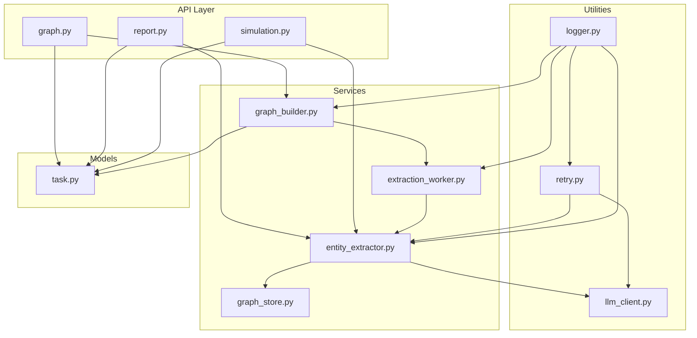
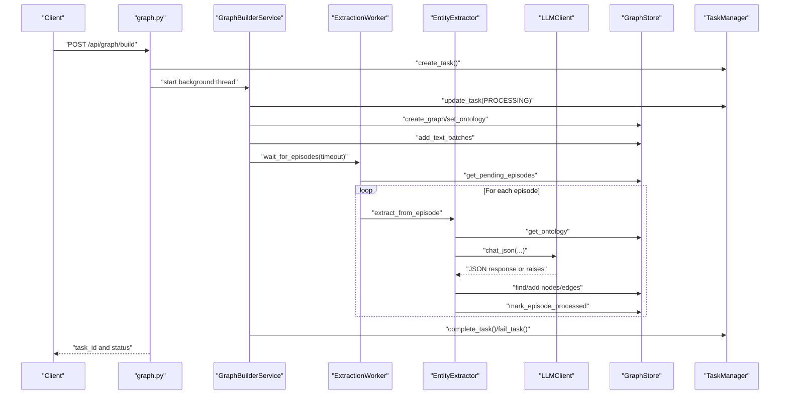
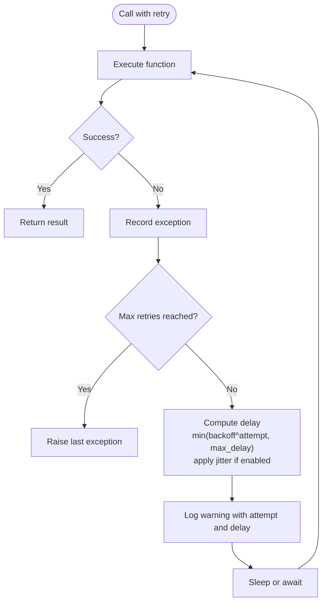
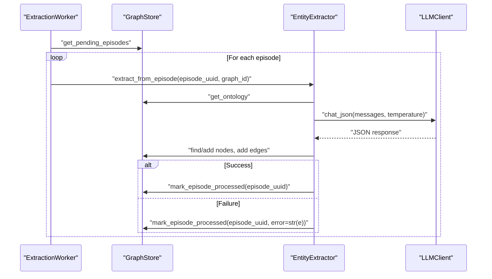
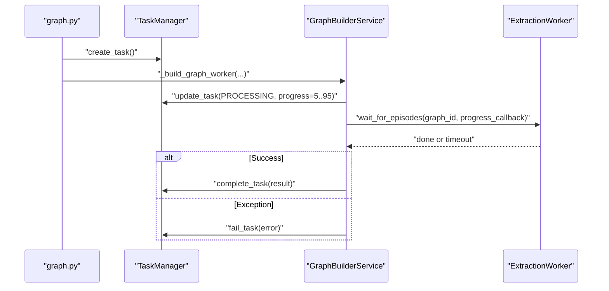
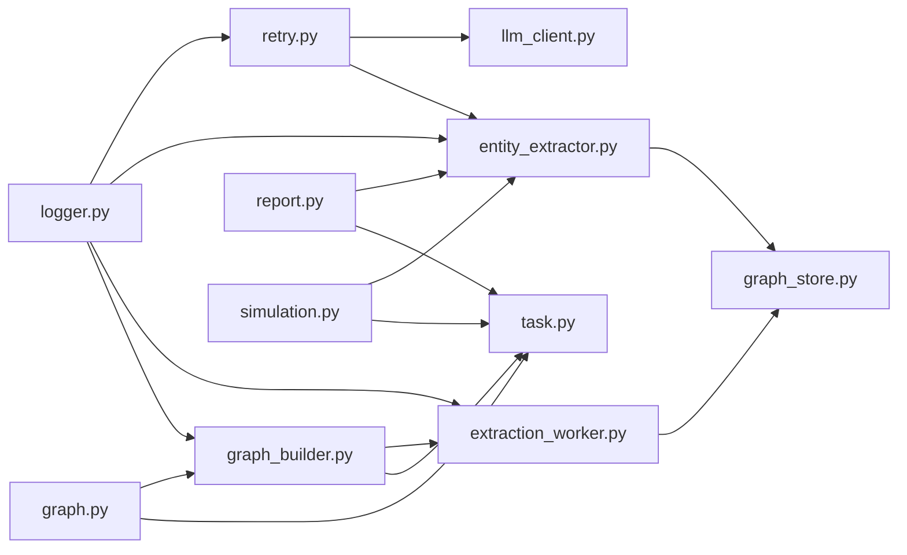

# Retry and Error Handling

<cite>
**Referenced Files in This Document**
- [retry.py](file://backend/app/utils/retry.py)
- [logger.py](file://backend/app/utils/logger.py)
- [llm_client.py](file://backend/app/utils/llm_client.py)
- [entity_extractor.py](file://backend/app/services/entity_extractor.py)
- [extraction_worker.py](file://backend/app/services/extraction_worker.py)
- [graph_builder.py](file://backend/app/services/graph_builder.py)
- [graph_store.py](file://backend/app/services/graph_store.py)
- [graph.py](file://backend/app/api/graph.py)
- [report.py](file://backend/app/api/report.py)
- [simulation.py](file://backend/app/api/simulation.py)
- [task.py](file://backend/app/models/task.py)
- [config.py](file://backend/app/config.py)
- [run.py](file://backend/run.py)
</cite>

## Table of Contents
1. [Introduction](#introduction)
2. [Project Structure](#project-structure)
3. [Core Components](#core-components)
4. [Architecture Overview](#architecture-overview)
5. [Detailed Component Analysis](#detailed-component-analysis)
6. [Dependency Analysis](#dependency-analysis)
7. [Performance Considerations](#performance-considerations)
8. [Troubleshooting Guide](#troubleshooting-guide)
9. [Conclusion](#conclusion)
10. [Appendices](#appendices)

## Introduction
This document explains the retry mechanisms and error handling strategies implemented in the application. It covers exponential backoff algorithms, retry limits, failure detection patterns, exception categorization, and integration with external services such as LLM APIs. It also documents timeout handling, graceful degradation, error propagation, logging of retry attempts, monitoring of failure rates, and practical guidance for implementing custom retry policies, handling partial failures, and recovery procedures. The goal is to help both developers and operators build resilient systems and troubleshoot common retry scenarios effectively.

## Project Structure
The retry and error handling capabilities are implemented across several layers:
- Utilities: retry decorators and helpers for exponential backoff and batch processing
- Services: LLM client integration, entity extraction, graph building, and worker orchestration
- API: HTTP endpoints that wrap long-running tasks and propagate errors
- Models: task management for progress and failure reporting
- Logging: centralized logging for retries and failures

**Diagram sources**
- [graph.py](file://backend/app/api/graph.py)
- [report.py](file://backend/app/api/report.py)
- [simulation.py](file://backend/app/api/simulation.py)
- [entity_extractor.py](file://backend/app/services/entity_extractor.py)
- [extraction_worker.py](file://backend/app/services/extraction_worker.py)
- [graph_builder.py](file://backend/app/services/graph_builder.py)
- [graph_store.py](file://backend/app/services/graph_store.py)
- [retry.py](file://backend/app/utils/retry.py)
- [llm_client.py](file://backend/app/utils/llm_client.py)
- [logger.py](file://backend/app/utils/logger.py)
- [task.py](file://backend/app/models/task.py)

**Section sources**
- [graph.py](file://backend/app/api/graph.py)
- [report.py](file://backend/app/api/report.py)
- [simulation.py](file://backend/app/api/simulation.py)
- [entity_extractor.py](file://backend/app/services/entity_extractor.py)
- [extraction_worker.py](file://backend/app/services/extraction_worker.py)
- [graph_builder.py](file://backend/app/services/graph_builder.py)
- [graph_store.py](file://backend/app/services/graph_store.py)
- [retry.py](file://backend/app/utils/retry.py)
- [llm_client.py](file://backend/app/utils/llm_client.py)
- [logger.py](file://backend/app/utils/logger.py)
- [task.py](file://backend/app/models/task.py)

## Core Components
- Exponential backoff retry utilities:
  - Decorators for synchronous and asynchronous functions
  - A callable client wrapper supporting retries and batch processing with partial failure handling
- LLM client integration:
  - Structured chat and JSON parsing with robust error handling
- Worker orchestration:
  - Background processing with timeouts and per-item error marking
- Task management:
  - Centralized task lifecycle with progress and error propagation
- Logging:
  - Structured logs for retries, warnings, and errors

Key implementation references:
- Retry decorators and client wrapper: [retry.py](file://backend/app/utils/retry.py)
- LLM client: [llm_client.py](file://backend/app/utils/llm_client.py)
- Entity extraction and worker: [entity_extractor.py](file://backend/app/services/entity_extractor.py), [extraction_worker.py](file://backend/app/services/extraction_worker.py)
- Graph builder and store: [graph_builder.py](file://backend/app/services/graph_builder.py), [graph_store.py](file://backend/app/services/graph_store.py)
- Task management: [task.py](file://backend/app/models/task.py)
- Logging: [logger.py](file://backend/app/utils/logger.py)

**Section sources**
- [retry.py](file://backend/app/utils/retry.py)
- [llm_client.py](file://backend/app/utils/llm_client.py)
- [entity_extractor.py](file://backend/app/services/entity_extractor.py)
- [extraction_worker.py](file://backend/app/services/extraction_worker.py)
- [graph_builder.py](file://backend/app/services/graph_builder.py)
- [graph_store.py](file://backend/app/services/graph_store.py)
- [task.py](file://backend/app/models/task.py)
- [logger.py](file://backend/app/utils/logger.py)

## Architecture Overview
The system integrates retry and error handling across the stack:
- API endpoints spawn long-running tasks and delegate to services
- Services orchestrate LLM calls and database operations with retries and timeouts
- Workers process episodes with per-item resilience and progress tracking
- Task manager records status, progress, and errors for monitoring and recovery

**Diagram sources**
- [graph.py](file://backend/app/api/graph.py)
- [graph_builder.py](file://backend/app/services/graph_builder.py)
- [extraction_worker.py](file://backend/app/services/extraction_worker.py)
- [entity_extractor.py](file://backend/app/services/entity_extractor.py)
- [llm_client.py](file://backend/app/utils/llm_client.py)
- [graph_store.py](file://backend/app/services/graph_store.py)
- [task.py](file://backend/app/models/task.py)

## Detailed Component Analysis

### Retry Utilities and Exponential Backoff
The retry utilities provide configurable exponential backoff with jitter and optional callbacks. They support:
- Synchronous and asynchronous wrappers
- Configurable max retries, initial delay, max delay, backoff factor, and jitter
- Exception filtering and on-retry hooks
- Batch processing with partial failure collection

Implementation highlights:
- Decorators define retry loops, compute delays, apply jitter, log warnings, and sleep between attempts
- The callable client supports per-call exception filtering and batch processing with continue-on-failure semantics
- Logging captures retry attempts and final failures

**Diagram sources**
- [retry.py](file://backend/app/utils/retry.py)

**Section sources**
- [retry.py](file://backend/app/utils/retry.py)

### LLM Client and JSON Parsing
The LLM client encapsulates OpenAI-compatible calls and adds robustness:
- Validates API key and base URL
- Sends structured prompts and parses JSON responses
- Removes model-specific thinking content and cleans markdown markers
- Raises explicit errors for invalid JSON

Integration with retries:
- The client is used inside extraction workflows where retries are applied at the service level
- Exceptions from the client bubble up and are handled by the surrounding retry mechanisms

**Section sources**
- [llm_client.py](file://backend/app/utils/llm_client.py)

### Entity Extraction and Episode Processing
Entity extraction orchestrates LLM calls to extract entities and relationships:
- Builds prompts with defined entity and relationship types
- Calls LLM and parses JSON
- Deduplicates and merges nodes, creates edges, and marks episodes processed
- Logs and marks failures per episode

Worker behavior:
- Iterates over pending episodes with a configurable timeout
- Processes episodes sequentially with per-episode error handling
- Marks episodes as processed even on failure to avoid infinite loops

**Diagram sources**
- [extraction_worker.py](file://backend/app/services/extraction_worker.py)
- [entity_extractor.py](file://backend/app/services/entity_extractor.py)
- [graph_store.py](file://backend/app/services/graph_store.py)
- [llm_client.py](file://backend/app/utils/llm_client.py)

**Section sources**
- [entity_extractor.py](file://backend/app/services/entity_extractor.py)
- [extraction_worker.py](file://backend/app/services/extraction_worker.py)
- [graph_store.py](file://backend/app/services/graph_store.py)

### Graph Building and Task Management
Graph building is a multi-stage process managed by a background thread:
- Creates graph and sets ontology
- Splits text into chunks and adds episodes
- Waits for LLM extraction to complete via the worker
- Retrieves graph data and updates task status

Task management:
- Tracks progress, messages, and errors
- Completes or fails tasks upon success or exception
- Provides endpoints to query task status

**Diagram sources**
- [graph.py](file://backend/app/api/graph.py)
- [graph_builder.py](file://backend/app/services/graph_builder.py)
- [task.py](file://backend/app/models/task.py)

**Section sources**
- [graph.py](file://backend/app/api/graph.py)
- [graph_builder.py](file://backend/app/services/graph_builder.py)
- [task.py](file://backend/app/models/task.py)

### API Error Handling Patterns
Endpoints implement consistent error handling:
- Validation and early exits with descriptive 4xx responses
- Try/catch around long-running operations
- Structured error payloads with optional tracebacks
- Background threads for async tasks with centralized task status updates

Examples:
- Ontology generation endpoint validates inputs and wraps generation in try/catch
- Graph build endpoint validates configuration, spawns background task, and returns task_id
- Report and simulation endpoints follow similar patterns for task creation and status queries

**Section sources**
- [graph.py](file://backend/app/api/graph.py)
- [report.py](file://backend/app/api/report.py)
- [simulation.py](file://backend/app/api/simulation.py)

### Logging and Monitoring Signals
Centralized logging:
- UTF-8-aware console and rotating file handlers
- Structured log format with timestamps, severity, logger name, and function location
- Retry utilities log warnings on each retry and errors on final failure
- Services log successes, warnings, and errors for traceability

Monitoring signals:
- Task progress and status provide operational visibility
- Errors are propagated to task managers and API responses
- Logs capture retry attempts and failure reasons for diagnostics

**Section sources**
- [logger.py](file://backend/app/utils/logger.py)
- [retry.py](file://backend/app/utils/retry.py)
- [task.py](file://backend/app/models/task.py)

## Dependency Analysis
The following diagram shows key dependencies among retry, services, and models:

**Diagram sources**
- [retry.py](file://backend/app/utils/retry.py)
- [llm_client.py](file://backend/app/utils/llm_client.py)
- [entity_extractor.py](file://backend/app/services/entity_extractor.py)
- [graph_store.py](file://backend/app/services/graph_store.py)
- [extraction_worker.py](file://backend/app/services/extraction_worker.py)
- [graph_builder.py](file://backend/app/services/graph_builder.py)
- [graph.py](file://backend/app/api/graph.py)
- [report.py](file://backend/app/api/report.py)
- [simulation.py](file://backend/app/api/simulation.py)
- [task.py](file://backend/app/models/task.py)
- [logger.py](file://backend/app/utils/logger.py)

**Section sources**
- [retry.py](file://backend/app/utils/retry.py)
- [llm_client.py](file://backend/app/utils/llm_client.py)
- [entity_extractor.py](file://backend/app/services/entity_extractor.py)
- [graph_store.py](file://backend/app/services/graph_store.py)
- [extraction_worker.py](file://backend/app/services/extraction_worker.py)
- [graph_builder.py](file://backend/app/services/graph_builder.py)
- [graph.py](file://backend/app/api/graph.py)
- [report.py](file://backend/app/api/report.py)
- [simulation.py](file://backend/app/api/simulation.py)
- [task.py](file://backend/app/models/task.py)
- [logger.py](file://backend/app/utils/logger.py)

## Performance Considerations
- Exponential backoff reduces thundering herd effects on external services
- Jitter mitigates synchronized retry storms
- Per-item batch processing allows partial progress and avoids blocking the whole batch
- Timeouts prevent indefinite waits in workers and keep the system responsive
- Logging overhead is minimal; structured logs aid debugging without impacting throughput
- Database operations are batched to reduce round-trips

[No sources needed since this section provides general guidance]

## Troubleshooting Guide
Common retry scenarios and debugging steps:
- LLM API failures:
  - Verify API key and base URL configuration
  - Check logs for retry attempts and final failure messages
  - Confirm exception types passed to retry utilities
- Partial failures in batch processing:
  - Inspect batch results and failure lists for indices and error messages
  - Enable continue-on-failure to process remaining items
- Episode processing timeouts:
  - Adjust timeout values in worker loops
  - Monitor progress callbacks to identify slow episodes
- Task status and progress:
  - Use task endpoints to query status and progress
  - Look for error fields and tracebacks in task payloads
- Logging and diagnostics:
  - Review structured logs for timestamps, function locations, and retry counts
  - On Windows, ensure UTF-8 console reconfiguration for readable logs

Operational checks:
- Validate configuration at startup
- Confirm database connectivity and migrations
- Ensure uploads and simulation directories exist and are writable

**Section sources**
- [retry.py](file://backend/app/utils/retry.py)
- [logger.py](file://backend/app/utils/logger.py)
- [task.py](file://backend/app/models/task.py)
- [extraction_worker.py](file://backend/app/services/extraction_worker.py)
- [graph.py](file://backend/app/api/graph.py)
- [run.py](file://backend/run.py)

## Conclusion
The application implements a robust retry framework with exponential backoff, jitter, and configurable limits. It integrates retries with LLM clients and database operations, provides per-item batch resilience, and manages long-running tasks with progress and error reporting. Logging and task management offer strong observability for diagnosing and recovering from transient failures. By following the guidelines in this document, teams can tune retry policies, handle partial failures gracefully, and maintain system reliability under external service variability.

[No sources needed since this section summarizes without analyzing specific files]

## Appendices

### Retry Configuration Examples
- Decorator usage:
  - Apply to functions requiring retries on specific exceptions
  - Configure max retries, initial delay, max delay, backoff factor, and jitter
- Callable client usage:
  - Wrap arbitrary function calls with retry and exception filtering
  - Use batch processing to handle partial failures and continue on error

References:
- [retry.py](file://backend/app/utils/retry.py)

**Section sources**
- [retry.py](file://backend/app/utils/retry.py)

### Timeout Handling and Graceful Degradation
- Worker loops enforce timeouts to avoid indefinite blocking
- On timeout, progress callbacks are invoked and the loop exits
- Graceful degradation:
  - Mark episodes as processed even on failure to prevent repeated attempts
  - Continue processing remaining items in batch mode when configured

References:
- [extraction_worker.py](file://backend/app/services/extraction_worker.py)
- [graph_store.py](file://backend/app/services/graph_store.py)

**Section sources**
- [extraction_worker.py](file://backend/app/services/extraction_worker.py)
- [graph_store.py](file://backend/app/services/graph_store.py)

### Error Propagation and Monitoring
- API endpoints catch exceptions and return structured error responses
- Task manager centralizes progress and error propagation
- Logging provides audit trails for retries and failures

References:
- [graph.py](file://backend/app/api/graph.py)
- [report.py](file://backend/app/api/report.py)
- [simulation.py](file://backend/app/api/simulation.py)
- [task.py](file://backend/app/models/task.py)
- [logger.py](file://backend/app/utils/logger.py)

**Section sources**
- [graph.py](file://backend/app/api/graph.py)
- [report.py](file://backend/app/api/report.py)
- [simulation.py](file://backend/app/api/simulation.py)
- [task.py](file://backend/app/models/task.py)
- [logger.py](file://backend/app/utils/logger.py)

### Circuit Breaker Pattern
- Not implemented as a dedicated component in the current codebase
- Recommendations:
  - Track failure rates and latency metrics alongside task status
  - Introduce a simple breaker that stops retries after sustained failures
  - Reopen breaker after a cooldown period

[No sources needed since this section provides general guidance]

### Best Practices for Resilient Design
- Use exponential backoff with jitter for external service calls
- Limit retry attempts and cap maximum delay
- Distinguish retryable vs non-retryable errors (e.g., network vs malformed requests)
- Implement timeouts for long-running operations
- Prefer idempotent operations and side-effect guards
- Monitor failure rates and adjust retry parameters dynamically

[No sources needed since this section provides general guidance]