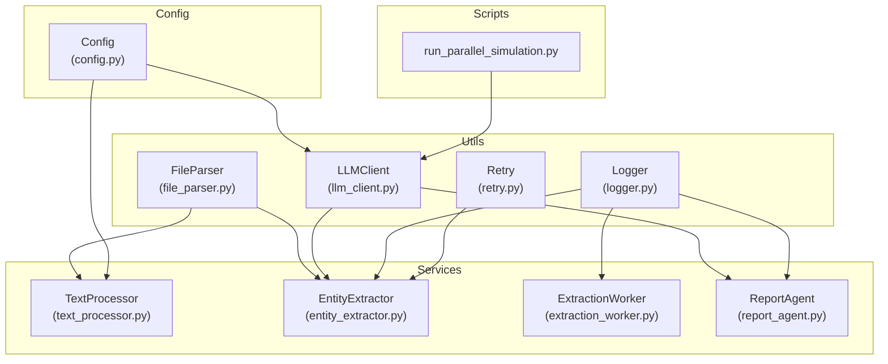
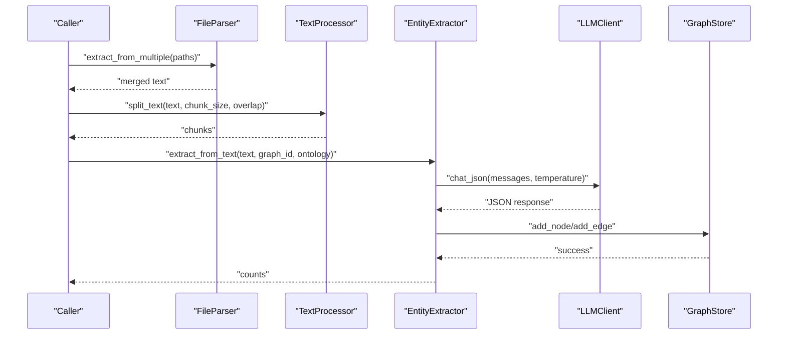
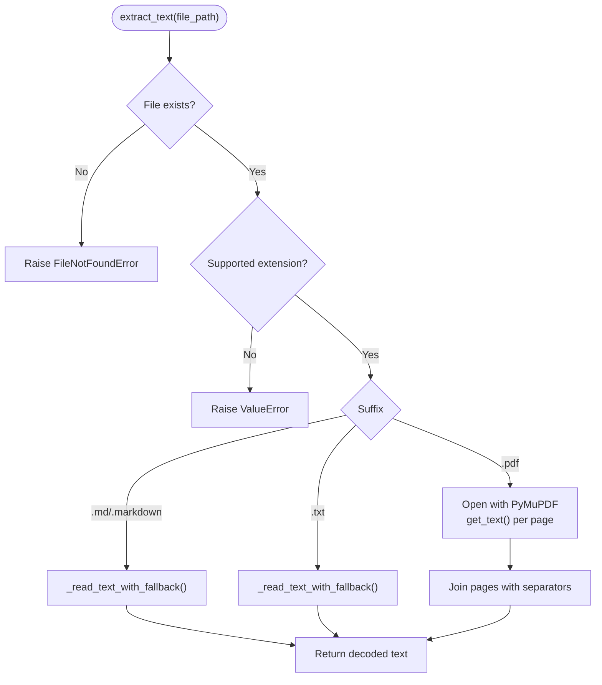
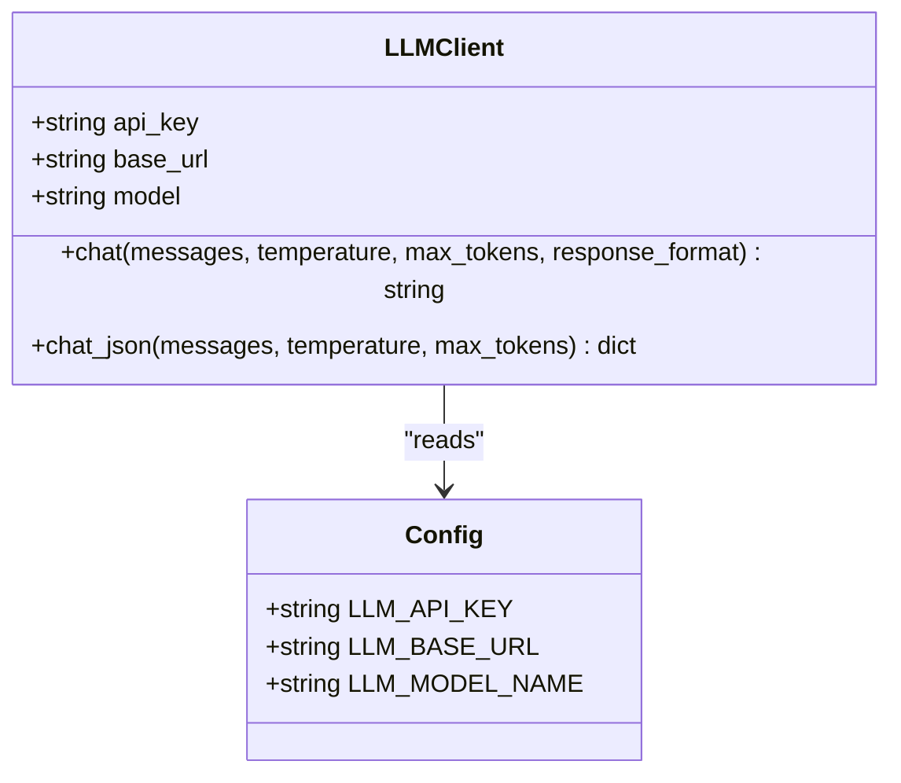
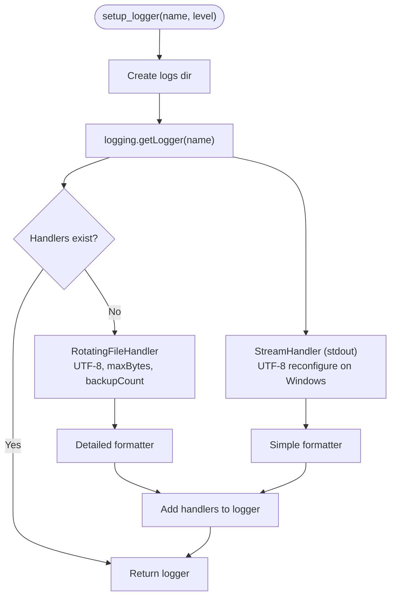
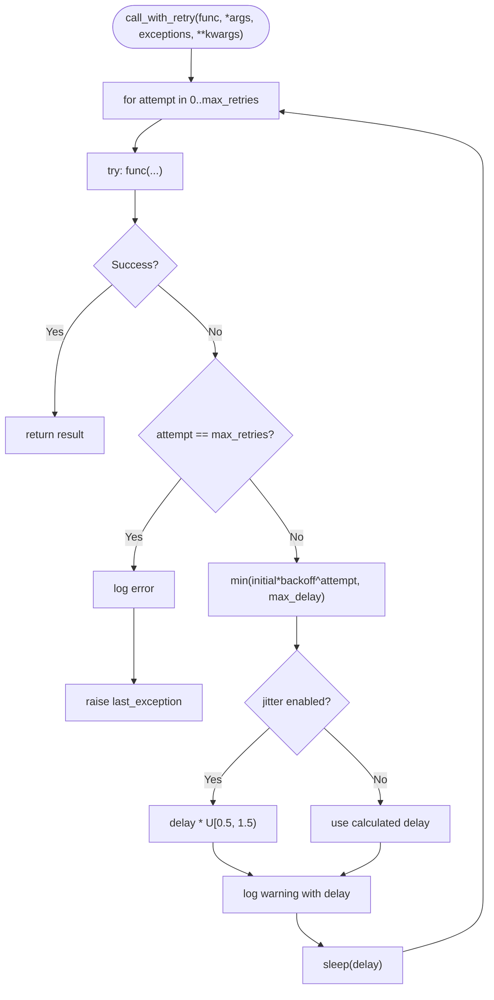
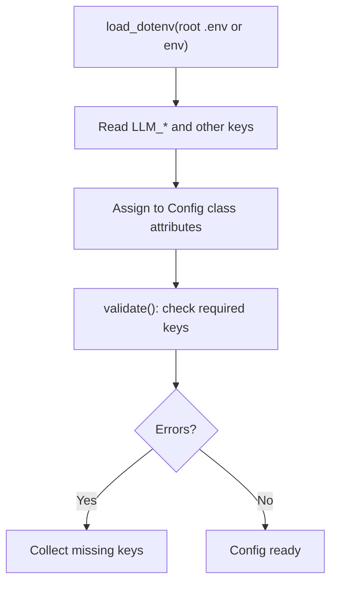
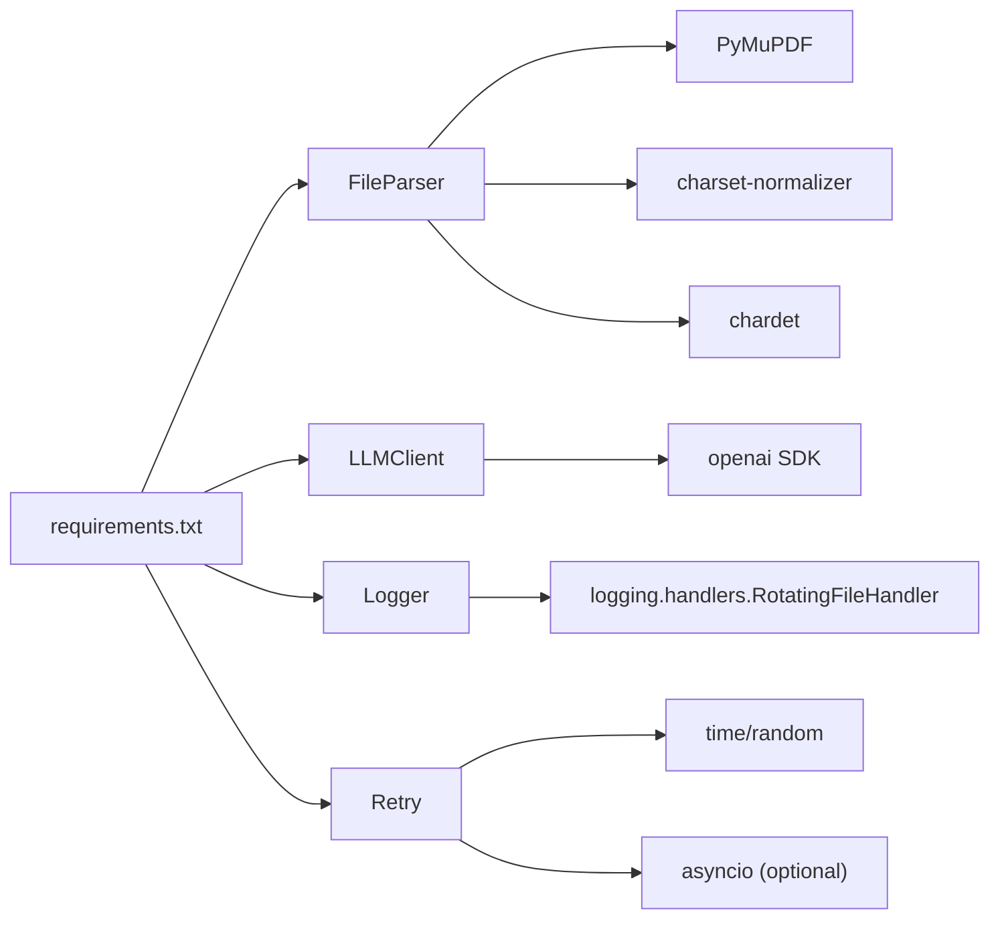

# Utility and Helper Modules

<cite>
**Referenced Files in This Document**
- [file_parser.py](file://backend/app/utils/file_parser.py)
- [llm_client.py](file://backend/app/utils/llm_client.py)
- [logger.py](file://backend/app/utils/logger.py)
- [retry.py](file://backend/app/utils/retry.py)
- [__init__.py](file://backend/app/utils/__init__.py)
- [config.py](file://backend/app/config.py)
- [text_processor.py](file://backend/app/services/text_processor.py)
- [entity_extractor.py](file://backend/app/services/entity_extractor.py)
- [extraction_worker.py](file://backend/app/services/extraction_worker.py)
- [report_agent.py](file://backend/app/services/report_agent.py)
- [run_parallel_simulation.py](file://backend/scripts/run_parallel_simulation.py)
- [requirements.txt](file://backend/requirements.txt)
</cite>

## Table of Contents
1. [Introduction](#introduction)
2. [Project Structure](#project-structure)
3. [Core Components](#core-components)
4. [Architecture Overview](#architecture-overview)
5. [Detailed Component Analysis](#detailed-component-analysis)
6. [Dependency Analysis](#dependency-analysis)
7. [Performance Considerations](#performance-considerations)
8. [Troubleshooting Guide](#troubleshooting-guide)
9. [Conclusion](#conclusion)
10. [Appendices](#appendices)

## Introduction
This document explains the utility and helper modules that power core application functionality. It covers:
- Document parsing and text extraction with PDF support via PyMuPDF and robust text encoding handling
- Unified LLM client integration compatible with OpenAI SDK for flexible provider usage
- Structured logging with console and rotating file outputs, including platform-specific fixes
- Retry mechanisms with exponential backoff and jitter for transient failure resilience
- Configuration management and environment variable handling
- Error handling patterns, exception management, and debugging support
- Practical usage examples across services and scripts
- Performance considerations and best practices

## Project Structure
The utilities live under backend/app/utils and are consumed by services and scripts across the backend. The configuration module centralizes environment-driven settings.

**Diagram sources**
- [file_parser.py:61-190](file://backend/app/utils/file_parser.py#L61-L190)
- [llm_client.py:14-104](file://backend/app/utils/llm_client.py#L14-L104)
- [logger.py:30-127](file://backend/app/utils/logger.py#L30-L127)
- [retry.py:15-239](file://backend/app/utils/retry.py#L15-L239)
- [text_processor.py:9-72](file://backend/app/services/text_processor.py#L9-L72)
- [entity_extractor.py:16-291](file://backend/app/services/entity_extractor.py#L16-L291)
- [extraction_worker.py:16-109](file://backend/app/services/extraction_worker.py#L16-L109)
- [report_agent.py:1-800](file://backend/app/services/report_agent.py#L1-L800)
- [config.py:20-76](file://backend/app/config.py#L20-L76)
- [run_parallel_simulation.py:984-1037](file://backend/scripts/run_parallel_simulation.py#L984-L1037)

**Section sources**
- [__init__.py:1-10](file://backend/app/utils/__init__.py#L1-L10)
- [config.py:1-76](file://backend/app/config.py#L1-L76)

## Core Components
- FileParser: Extracts text from PDF, Markdown, and TXT with robust encoding detection and multi-file merging
- LLMClient: Unified OpenAI-compatible client with JSON response parsing and provider flexibility
- Logger: Structured logging with rotating file handlers and console output, including Windows UTF-8 fix
- Retry: Decorators and client for exponential backoff with jitter and batch retry support

**Section sources**
- [file_parser.py:61-190](file://backend/app/utils/file_parser.py#L61-L190)
- [llm_client.py:14-104](file://backend/app/utils/llm_client.py#L14-L104)
- [logger.py:30-127](file://backend/app/utils/logger.py#L30-L127)
- [retry.py:15-239](file://backend/app/utils/retry.py#L15-L239)

## Architecture Overview
The utilities integrate with services and scripts to enable document ingestion, LLM-powered processing, and resilient operation under transient failures.

**Diagram sources**
- [file_parser.py:124-144](file://backend/app/utils/file_parser.py#L124-L144)
- [text_processor.py:12-34](file://backend/app/services/text_processor.py#L12-L34)
- [entity_extractor.py:168-245](file://backend/app/services/entity_extractor.py#L168-L245)
- [llm_client.py:70-104](file://backend/app/utils/llm_client.py#L70-L104)

## Detailed Component Analysis

### FileParser
- Supported formats: PDF (.pdf), Markdown (.md, .markdown), TXT (.txt)
- Robust text decoding with fallbacks: UTF-8 → charset-normalizer → chardet → UTF-8 with replacement
- PDF text extraction via PyMuPDF with page-wise concatenation
- Multi-file merging with per-document headers and failure isolation
- Text chunking with configurable size and overlap, attempting sentence boundary alignment

**Diagram sources**
- [file_parser.py:67-94](file://backend/app/utils/file_parser.py#L67-L94)
- [file_parser.py:97-121](file://backend/app/utils/file_parser.py#L97-L121)
- [file_parser.py:11-58](file://backend/app/utils/file_parser.py#L11-L58)

Key behaviors and complexity:
- Decoding fallbacks: O(n) per file to bytes, with charset detection adding overhead proportional to content size
- PDF extraction: O(p) for p pages; text concatenation O(t) where t is total characters
- Multi-file merging: O(m·t) where m is number of files and t is cumulative text length
- Chunk splitting: O(t) with sentence boundary heuristics; worst-case O(t) without boundaries

Usage examples:
- Services call FileParser to merge documents before LLM processing
- Scripts and workers rely on robust decoding for heterogeneous uploads

**Section sources**
- [file_parser.py:61-190](file://backend/app/utils/file_parser.py#L61-L190)
- [text_processor.py:12-34](file://backend/app/services/text_processor.py#L12-L34)

### LLMClient
- Initializes OpenAI SDK client using Config-provided API key, base URL, and model
- chat(): Sends messages with temperature and max_tokens; strips provider-specific thinking tags
- chat_json(): Requests JSON mode, cleans markdown code fences, parses and validates JSON
- Provider agnostic via base_url; supports alternate providers by changing base URL

**Diagram sources**
- [llm_client.py:14-104](file://backend/app/utils/llm_client.py#L14-L104)
- [config.py:30-33](file://backend/app/config.py#L30-L33)

Integration patterns:
- EntityExtractor and ReportAgent construct LLMClient instances and call chat/chat_json
- Scripts can configure dual LLMs for parallel simulation throughput

**Section sources**
- [llm_client.py:14-104](file://backend/app/utils/llm_client.py#L14-L104)
- [entity_extractor.py:22-57](file://backend/app/services/entity_extractor.py#L22-L57)
- [report_agent.py:21-32](file://backend/app/services/report_agent.py#L21-L32)
- [run_parallel_simulation.py:984-1037](file://backend/scripts/run_parallel_simulation.py#L984-L1037)

### Logger
- Creates a named logger with:
  - Rotating file handler (UTF-8, 10 MB max, 5 backups)
  - Console handler (INFO and above, concise format)
- Ensures UTF-8 stdout/stderr on Windows to prevent garbled output
- Provides convenience methods (debug/info/warning/error/critical)
- Prevents duplicate handlers and avoids propagation to root logger

**Diagram sources**
- [logger.py:30-88](file://backend/app/utils/logger.py#L30-L88)
- [logger.py:13-24](file://backend/app/utils/logger.py#L13-L24)

Usage patterns:
- Services import get_logger('parallelworld.<module>') and log structured messages
- ReportAgent maintains both JSONL and console logs for detailed tracing

**Section sources**
- [logger.py:30-127](file://backend/app/utils/logger.py#L30-L127)
- [report_agent.py:35-386](file://backend/app/services/report_agent.py#L35-L386)

### Retry
- retry_with_backoff: Decorator with exponential backoff, optional jitter, and on_retry callback
- retry_with_backoff_async: Async variant using asyncio.sleep
- RetryableAPIClient: Imperative retry with configurable max_retries, delays, and backoff_factor
- call_batch_with_retry: Processes a list with per-item retry and continues on failure option

**Diagram sources**
- [retry.py:15-77](file://backend/app/utils/retry.py#L15-L77)
- [retry.py:132-194](file://backend/app/utils/retry.py#L132-L194)

Usage patterns:
- Wrap LLM calls and external API invocations
- Batch processing with per-item retry and failure aggregation

**Section sources**
- [retry.py:15-239](file://backend/app/utils/retry.py#L15-L239)

### Configuration Management
- Loads .env from project root with override semantics
- Centralized settings: LLM_API_KEY, LLM_BASE_URL, LLM_MODEL_NAME, DATABASE_URL, upload limits, chunk defaults, simulation parameters
- Validation method to surface missing required keys

**Diagram sources**
- [config.py:9-76](file://backend/app/config.py#L9-L76)

**Section sources**
- [config.py:1-76](file://backend/app/config.py#L1-L76)

## Dependency Analysis
- FileParser depends on PyMuPDF for PDF, charset-normalizer/chardet for text decoding
- LLMClient depends on OpenAI SDK and Config for credentials and endpoint
- Logger depends on logging and RotatingFileHandler; Windows-specific UTF-8 reconfiguration
- Retry depends on time/random and optionally asyncio for async variants
- Services depend on these utilities for parsing, LLM calls, logging, and resilience

**Diagram sources**
- [requirements.txt:24-32](file://backend/requirements.txt#L24-L32)
- [file_parser.py:100-102](file://backend/app/utils/file_parser.py#L100-L102)
- [llm_client.py](file://backend/app/utils/llm_client.py#L9)
- [logger.py](file://backend/app/utils/logger.py#L10)
- [retry.py:6-12](file://backend/app/utils/retry.py#L6-L12)

**Section sources**
- [requirements.txt:1-36](file://backend/requirements.txt#L1-L36)

## Performance Considerations
- FileParser
  - Prefer streaming or chunked processing for very large PDFs to reduce memory spikes
  - Use split_text_into_chunks with sensible chunk_size and overlap to balance context retention and token limits
  - Cache decoded text for repeated access to the same file
- LLMClient
  - Tune temperature and max_tokens per use case; lower temperature for deterministic JSON
  - Use base_url to route to faster regional endpoints or alternative providers
  - Consider rate limiting and batching to avoid provider throttling
- Logger
  - Keep INFO-level console output concise; reserve detailed file logs for debugging
  - Monitor log file sizes and rotation policies to avoid disk pressure
- Retry
  - Adjust max_retries, initial_delay, and backoff_factor based on provider SLAs and acceptable latency
  - Use jitter to prevent thundering herd effects
  - For batch operations, consider continue_on_failure to maximize throughput

[No sources needed since this section provides general guidance]

## Troubleshooting Guide
Common issues and resolutions:
- Missing PyMuPDF
  - Symptom: ImportError when extracting PDFs
  - Resolution: Install PyMuPDF per requirements
- Invalid JSON from LLM
  - Symptom: ValueError indicating invalid JSON
  - Resolution: Verify response_format and provider compatibility; inspect cleaned response
- Missing LLM credentials
  - Symptom: ValueError on LLMClient init
  - Resolution: Set LLM_API_KEY in .env or environment
- Garbled console output on Windows
  - Symptom: Non-UTF-8 characters in logs
  - Resolution: Logger auto-reconfigures UTF-8 on Windows; ensure terminal supports UTF-8
- Excessive retries and timeouts
  - Symptom: Slow operations or timeouts
  - Resolution: Reduce max_retries or increase provider quotas; monitor provider health

**Section sources**
- [file_parser.py:100-102](file://backend/app/utils/file_parser.py#L100-L102)
- [llm_client.py:27-28](file://backend/app/utils/llm_client.py#L27-L28)
- [logger.py:18-23](file://backend/app/utils/logger.py#L18-L23)
- [retry.py:54-56](file://backend/app/utils/retry.py#L54-L56)

## Conclusion
The utility modules provide a cohesive foundation for document processing, LLM integration, logging, and resilience. By leveraging structured logging, robust text extraction, unified LLM access, and exponential backoff retry strategies, the system achieves reliability and maintainability. Proper configuration and mindful tuning of chunk sizes, retry parameters, and LLM settings ensure optimal performance across diverse workloads.

[No sources needed since this section summarizes without analyzing specific files]

## Appendices

### Usage Examples Across the Application
- Text processing pipeline
  - Merge multiple documents: [FileParser.extract_from_multiple:124-144](file://backend/app/utils/file_parser.py#L124-L144)
  - Split into chunks: [split_text_into_chunks:147-188](file://backend/app/utils/file_parser.py#L147-L188)
  - Preprocess and compute stats: [TextProcessor methods:17-71](file://backend/app/services/text_processor.py#L17-L71)
- LLM-powered extraction
  - Chat JSON with structured output: [LLMClient.chat_json:70-104](file://backend/app/utils/llm_client.py#L70-L104)
  - Entity extraction workflow: [EntityExtractor:26-167](file://backend/app/services/entity_extractor.py#L26-L167)
- Logging and monitoring
  - Structured logs with rotating files: [Logger setup:30-88](file://backend/app/utils/logger.py#L30-L88)
  - Report agent detailed logging: [ReportLogger:35-291](file://backend/app/services/report_agent.py#L35-L291)
- Resilient operations
  - Decorator-based retry: [retry_with_backoff:15-77](file://backend/app/utils/retry.py#L15-L77)
  - Batch retry with failure aggregation: [RetryableAPIClient.call_batch_with_retry:195-237](file://backend/app/utils/retry.py#L195-L237)
- Dual LLM configuration for simulations
  - Switch between general and boost LLMs: [run_parallel_simulation LLM selection:984-1037](file://backend/scripts/run_parallel_simulation.py#L984-L1037)

**Section sources**
- [text_processor.py:12-71](file://backend/app/services/text_processor.py#L12-L71)
- [entity_extractor.py:26-167](file://backend/app/services/entity_extractor.py#L26-L167)
- [report_agent.py:35-291](file://backend/app/services/report_agent.py#L35-L291)
- [retry.py:15-239](file://backend/app/utils/retry.py#L15-L239)
- [run_parallel_simulation.py:984-1037](file://backend/scripts/run_parallel_simulation.py#L984-L1037)